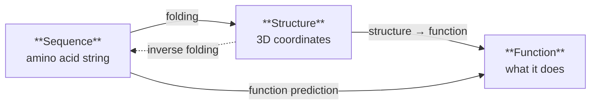
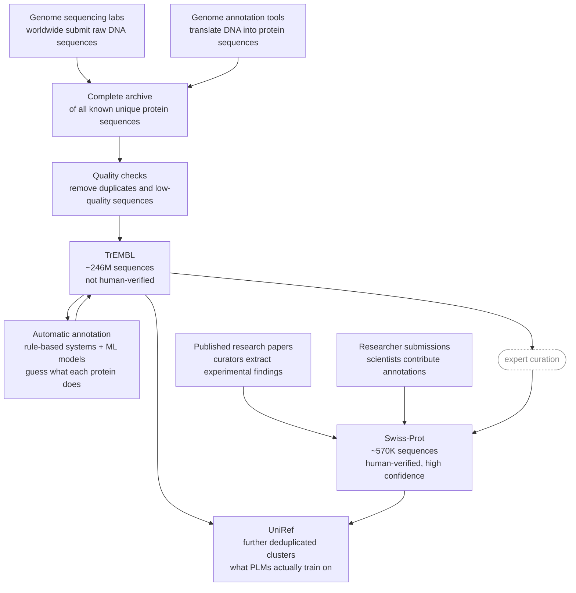

### Proteins are just like sentences

Proteins are sequences of amino acids, and every protein in living things is simply a unique sequence of these amino acids.  The ordering alone determines the shape and functionality alone of these proteins.  Now when ML researchers came across this domain, they figured, if we have transformers that create sentences--i.e. sequences of words--why can't we have transformers create proteins, which are sequences of amino acids.

Essentially, we could just swap **words → amino acids**!

Below are two sequences: an English sentence and the first 15 residues of ubiquitin, one of the most studied proteins in biology. Click any token to see what a language model (BERT) and a protein language model (ESM) think about swapping it out.

<iframe id="mutation-frame-1" src="{{ site.baseurl }}/assets/files/protein/mutation_explorer.html" 
  style="width:100%;border:none;" scrolling="no" height="600"></iframe>
<script>
window.addEventListener('message', function(e) {
  if (e.data && e.data.iframeHeight && e.source === document.getElementById('mutation-frame-1').contentWindow) {
    document.getElementById('mutation-frame-1').style.height = e.data.iframeHeight + 'px';
  }
});
</script>

Both models actually show a similar pattern here. Some positions are flexible — the model assigns reasonable probability to many substitutions. Some are locked — one strong opinion, everything else gets penalized. 

Notice how this illustrates the core problem.  To make a sentence, you must choose and order words in the right way for a target meaning.  To make a protein, you must choose and order amino acids the right way for a target functionality.  The entire problem is to make a model be able to do this effectively!

### Crash course!


#### Amino acids

```
        R group
         │
Amino ── Cα ── Carboxyl
         │
         H
```

The **amino group** and **carboxyl group** are the two ends that connect amino acids together into a long chain which is a protein. Every amino acid has the same amino and carboxyl groups, meaning the protein backbone is nearly identical regardless of the sequence.

The **R group** (or side chain) is the only part that differs between amino acids. There are 20 standard amino acids, each with a different R group. These side chains determine each amino acid's chemical properties and interact with one another, ultimately causing the protein to fold into its three-dimensional structure.  

Here's what that skeleton actually looks like in 3D. Drag to rotate the molecule below, and notice how the amino group, α-carbon, and carboxyl group form a fixed, shared backbone — the R group is the only piece hanging off to the side, waiting to be swapped out for one of the 20 options.

<iframe id="amino-acid-anatomy-frame" src="{{ site.baseurl }}/assets/files/protein/amino_acid_anatomy.html"
  style="width:100%;border:none;" scrolling="no" height="500"></iframe>
<script>
window.addEventListener('message', function(e) {
  if (e.data && e.data.iframeHeight && e.source === document.getElementById('amino-acid-anatomy-frame').contentWindow) {
    document.getElementById('amino-acid-anatomy-frame').style.height = e.data.iframeHeight + 'px';
  }
});
</script>

> These protein models are rendered via [3mol.js](https://academic.oup.com/bioinformatics/article/31/8/1322/213186?login=false) -- super cool library!  Drag around with your mouse to rotate, right click and drag to pan.
{: .prompt-tip}

For example, some R groups are hydrophobic ("water-fearing") and prefer to be buried inside the protein away from water, while others are hydrophilic ("water-loving") and tend to remain exposed on the protein's surface. Some side chains carry positive or negative charges, attracting or repelling one another like magnets, while others can form hydrogen bonds that stabilize specific parts of the structure. The final folded protein is the **result of balancing thousands of these local interactions**, finding a stable three-dimensional arrangement that minimizes the protein's free energy.

<iframe id="side-chain-gallery-frame" src="{{ site.baseurl }}/assets/files/protein/side_chain_gallery.html"
  style="width:100%;border:none;" scrolling="no" height="900"></iframe>
<script>
window.addEventListener('message', function(e) {
  if (e.data && e.data.iframeHeight && e.source === document.getElementById('side-chain-gallery-frame').contentWindow) {
    document.getElementById('side-chain-gallery-frame').style.height = e.data.iframeHeight + 'px';
  }
});
</script>

Finally, the **Cα (alpha carbon)** is the central carbon atom that connects all four components. Since every amino acid contains exactly one Cα atom, structural biology uses its 3D coordinates as a representative ***location for the entire residue***. 

Put together, a protein looks like this:

```
      R1          R2          R3
       │           │           │
H2N ─ Cα ─ C ─ N ─ Cα ─ C ─ N ─ Cα ─ C ─ OH
       │           │           │
       H           H           H
```


#### Four levels of structure

Proteins have four levels of structure, each emerging from the one below.

**Primary structure** is just the sequence. A string of amino acids, one after another. MQIFVKTLTG... This is what ESM trains on. This is the "text."

**Secondary structure** is what happens locally when the chain starts to fold. Certain stretches coil into helices, others flatten into sheets. These patterns are driven by hydrogen bonding between nearby residues and are relatively predictable from local sequence chemistry.

**Tertiary structure** is the full 3D shape of a single protein chain — how those helices and sheets pack together in space. This is what AlphaFold predicts. It's determined by long-range interactions between residues that may be hundreds of positions apart in the sequence. This is where it gets hard.

**Quaternary structure** is multiple chains coming together into a complex. Hemoglobin is four chains. AlphaFold3 extended structure prediction to this level.


*The four levels of protein structure. (Source: [wikimedia](https://upload.wikimedia.org/wikipedia/commons/a/a6/Protein-structure.png))*


Below is an interactive showing the different levels.  Click the top buttons to view the different structures.

<iframe id="four-levels-frame" src="{{ site.baseurl }}/assets/files/protein/four_levels_of_structure.html"
  style="width:100%;border:none;" scrolling="no" height="750"></iframe>
<script>
window.addEventListener('message', function(e) {
  if (e.data && e.data.iframeHeight && e.source === document.getElementById('four-levels-frame').contentWindow) {
    document.getElementById('four-levels-frame').style.height = e.data.iframeHeight + 'px';
  }
});
</script>


The key thing to take away: each level emerges from the level below, but in a way that's not locally predictable. The sequence determines everything — but you can't read off the 3D shape by looking at any short stretch of it. You need to understand the whole thing at once. That's why this problem is hard, and why it's surprising that protein language models learn anything about tertiary structure from sequence statistics alone.

### The different protein modeling problems

Now protein models actually come in many types, each solving a different problem in the space.  We first want to be able to take a sequence and then be able to figure how the protein will fold in 3D space.  This is the problem the famous AlphaFold models actually solve.  However, just knowing how a protein will fold isn't that useful.  We also need to know how its structure will affect its function—i.e. its behavior.  Finally, there's also an entire space of inverse-folding, where we want to start with what we want the protein to do (and hence also how it should look like) and then come up with the sequence of amino acids that can produce this.  You can think of this inverse-folding problem as the thing that will enable us to make synthetic proteins for different applications.



Now a much simpler problem is the **representation problem**.  Before we even try to predict structure, we want to be able to represent amino acid sequences in a rich manner (embeddings).  Just like how we have models like BERT in the natural language, in the protein domain as well do we have the basic requirement of being able to represent these amino acid sequences in a meaningful way that encodes important information about it.  Then we can use this model for downstream tasks, such as folding or function prediction, where they don't have to deal with understanding *what a sequence here means* and instead focus on *what to do with it*.

See below for an animation of how ESM-2 generates embeddings.

<iframe id="embedding-frame" src="{{ site.baseurl }}/assets/files/protein/embedding.html" 
  style="width:100%;border:none;" scrolling="no" height="400"></iframe>
<script>
window.addEventListener('message', function(e) {
  if (e.data && e.data.iframeHeight && e.source === document.getElementById('embedding-frame').contentWindow) {
    document.getElementById('embedding-frame').style.height = e.data.iframeHeight + 'px';
  }
});
</script>

Just like BERT, each vector isn't just "what amino acid is this" — it captures context. The three T residues at positions 7, 9, and 12 all get different vectors, even though they're the same character. Same token, different neighbors, different embedding.

All these models are called **Protein Language Models (PLMs)** — transformers trained on protein sequences the same way BERT and GPT are trained on text. Some models combine multiple problems: ESMFold uses PLM embeddings to predict structure directly, skipping the need for a separate folding model. ESM3 goes furthest — it jointly reasons over sequence, structure, and function in a single model, so any modality can prompt any other.

See the table below for an overview—but don't feel nervous if it looks daunting, we'll break it down in this blog post!

| Problem | Models | Input → Output |
|---|---|---|
| Representation | [ESM-1b](https://www.pnas.org/doi/10.1073/pnas.2016239118), [ESM-2](https://www.science.org/doi/10.1126/science.ade2574), [ProtBERT](https://arxiv.org/abs/2007.06225), [ESM-C](https://evolutionaryscale.ai/blog/esm-cambrian) | Sequence → Embeddings |
| Folding | [AlphaFold2](https://www.nature.com/articles/s41586-021-03819-2), [RoseTTAFold](https://www.science.org/doi/10.1126/science.abj8754), [AF3](https://www.nature.com/articles/s41586-024-07487-w) | Sequence → 3D coordinates |
| Folding (from embeddings) | [ESMFold](https://www.science.org/doi/10.1126/science.ade2574) | PLM embeddings → 3D coordinates |
| Function prediction | [ESM-2 + head](https://www.science.org/doi/10.1126/science.ade2574), [SaProt](https://arxiv.org/abs/2310.20212) | Sequence → Function |
| Inverse folding | [ProteinMPNN](https://www.science.org/doi/10.1126/science.add2187), [RFdiffusion](https://www.nature.com/articles/s41586-023-06415-8) | Structure → Sequence |
| Multimodal | [ESM3](https://www.science.org/doi/10.1126/science.ads0018) | Any → Any |

### Hold up, proteins are NOT like sentences

So far, I've projected this protein modeling problem as being just like NLP.  I'm sorry to say that I may have actually severely over stated that :P .  **Turns out, there are a lot of difficult challenges in this domain.**


#### 1. The protein language only has 20 words

There are only 20 amino acids in nature.  So every single protein is a sequence of these 20 amino acids.  This means our protein models only have a vocabulary size of **20** tokens, compared to hundreds of thousands of tokens in GPT-4!

<iframe id="vocab-frame" src="{{ site.baseurl }}/assets/files/protein/vocab_compare.html" 
  style="width:100%;border:none;" scrolling="no" height="350"></iframe>
<script>
window.addEventListener('message', function(e) {
  if (e.data && e.data.iframeHeight && e.source === document.getElementById('vocab-frame').contentWindow) {
    document.getElementById('vocab-frame').style.height = e.data.iframeHeight + 'px';
  }
});
</script>

> Technically 22 amino acids occur naturally — selenocysteine and pyrrolysine are rare, genetically-encoded exceptions found in a handful of organisms — and most models also reserve a token for unknown/non-standard residues (often X). The "20" convention holds for the vast majority of sequence data and is what virtually all PLMs are trained on.
{: .prompt-warning}

#### 2. Small errors yield catastrophic results
Let's look at this interactive again (click on a word / amino acid to see candidate swaps and their scores):

<iframe id="mutation-frame-2" src="{{ site.baseurl }}/assets/files/protein/mutation_explorer.html" 
  style="width:100%;border:none;" scrolling="no" height="600"></iframe>
<script>
window.addEventListener('message', function(e) {
  if (e.data && e.data.iframeHeight && e.source === document.getElementById('mutation-frame-2').contentWindow) {
    document.getElementById('mutation-frame-2').style.height = e.data.iframeHeight + 'px';
  }
});
</script>

When you swap "time" for "banana" in the sentence, you get something weird. The reader figures it out and moves on — language has a human on the other end who recovers the meaning.  Now swap the G at position 10 in ubiquitin for anything else. Glycine is the only amino acid with no side chain, meaning it's the only one that can make the tight backbone turn ubiquitin needs at that position. The protein misfolds. The cell's entire protein recycling system starts to break down. There's no human on the other end recovering anything — the physics just doesn't work.

> Fun Fact: The last two residues of ubiquitin — Gly-Gly — are the most conserved positions in eukaryotic biology. They get cleaved to activate ubiquitin's "tag this for destruction" function. ESM gives them the lowest substitution scores in the entire sequence — it learned this from statistics alone. They're not shown in the interactive above (which only covers the first 15 residues), but the model was scored on the full 76-residue sequence, so that signal is real.
{: .prompt-info}

Let's put that argument to the physical test. Below is the real, experimentally solved structure of ubiquitin (PDB 1UBQ) — the same protein, the same first 15 residues as the mutation explorer above. Click through a few positions and watch two things: the secondary structure readout, and the Cα(i−1)–Cα(i+1) distance — a rough measure of how sharply the backbone bends right at that residue.

Most positions will look unremarkable: extended backbone, nothing dramatic. Then click G10. Watch that distance drop and the verdict flip to "tight turn" — you're looking at the exact kink that only glycine's missing side chain makes possible. This is what "small errors yield catastrophic results" actually looks like in 3D, not just in the abstract.

<iframe id="ubiquitin-frame" src="{{ site.baseurl }}/assets/files/protein/ubiquitin_position_explorer.html"
  style="width:100%;border:none;" scrolling="no" height="750"></iframe>
<script>
window.addEventListener('message', function(e) {
  if (e.data && e.data.iframeHeight && e.source === document.getElementById('ubiquitin-frame').contentWindow) {
    document.getElementById('ubiquitin-frame').style.height = e.data.iframeHeight + 'px';
  }
});
</script>

We can also observe this in the classic case of sickle cell disease.  A single swap of an amino acid from Glutamate to Valine causes the hemoglobin protein (which is used to carry oxygen by red blood cells) to become unable to carry oxygen.

<iframe id="sickle-frame" src="{{ site.baseurl }}/assets/files/protein/sickle_cell.html" 
  style="width:100%;border:none;" scrolling="no" height="450"></iframe>
<script>
window.addEventListener('message', function(e) {
  if (e.data && e.data.iframeHeight && e.source === document.getElementById('sickle-frame').contentWindow) {
    document.getElementById('sickle-frame').style.height = e.data.iframeHeight + 'px';
  }
});
</script>

#### 3. No ground truth at scale

There are three main datasets in this space: [UniProt](https://www.uniprot.org/), [Protein Data Bank (PDB)](https://www.rcsb.org/), and [AlphaFold Database](https://alphafold.ebi.ac.uk/).  Let's go over what each of those contribute.

##### UniProt: tons of amino acid sequences

UniProt contains a bunch of amino acid sequences of different proteins—about ~250 million sequences in fact!  This is awesome—you can train models to predict the next amino acid (self-supervised learning) really easily at scale.  The problem is that not all of these sequences have *labels*—what each sequence actually corresponds to in function of the protein.  This means it is really difficult to train models to predict downstream tasks, such as predicting if a mutation will cause a disease or enzyme activity (i.e. how well does a protein accelerate a reaction).  Of all the sequences only around 550,000 sequences have been manually curated by expert biologists — the rest are automatically annotated by rule systems.



Protein sequences are collected from genome sequencing labs worldwide and flow into TrEMBL, a massive database of ~246 million sequences that are automatically annotated by rule-based systems and ML models. A tiny fraction — around 570,000 — get promoted to Swiss-Prot through expert human curation, where annotations are verified against published experimental evidence. Both feed into UniRef, a deduplicated version of the database that protein language models actually train on.







##### Protein Data Bank: dataset of experimentally verified structures

The PDB has around 200,000 experimentally examples of protein structures that were verified experimentally.  This is great—you really can't get a more accurate dataset than this.  The problem, though is that 200,000 pales in comparison to the millions of amino acid sequences out there.  We really can't train a large model on just this 200,000 datapoints.  There is a whole lot more amino acid sequences out there that we don't know the shape for.

##### AlphaFold Database

The AlphaFold DB now contains more than 241 million predicted structures, essentially covering all of UniProt. This sounds like it closes the gap completely—and in some ways it does.  But the caveat is that these are *predicted* structures from their AlphaFold model.  These predictions could be wrong, making this not a gold-standard dataset.

As you can see, there is a major data shortage in this domain—despite being able to sequence the genome, which leads us to be able to store millions of amino acid sequences, the data of how these sequences behave as proteins simply isn't there at scale.

##### CASP: a competition, not a dataset

So how do we know any of these predicted structures — from AlphaFold or anyone else — are actually trustworthy? This is exactly the question **CASP (Critical Assessment of protein Structure Prediction)** was built to answer. 

CASP is a competition held every two years, where organizers work with biology labs around the workd to identify target proteins that are being actively solved experimentally by haven't been published yet (i.e no one publicly knows how it folds).  Organizers compile a set of proteins to test the ML models on.  At submission time these answers aren't known by the model-makers so this serves as an unbiased way of measuring model performance, where the test examples aren't leaked into the training data for these models.

> **Extra info on CASP:** It's run by an independent, volunteer, worldwide research community — not a company — and has taken place every two years since 1994. Targets span the full difficulty spectrum, from routine sequences to genuinely novel folds with no close relatives in the PDB, so predictors are scored across easy and hard cases alike. CASP is also where the field's structure-comparison metrics were popularized — TM-score (covered below) and GDT-TS are the same metrics used to rank CASP submissions. And CASP isn't just for folding: recent rounds also run tracks for complexes and function prediction, tracking the field far beyond single-chain structure. CASP14 (2020) is the round where AlphaFold2 crossed a score threshold widely regarded as "solving" the single-chain structure prediction problem.
{: .prompt-info}

#### 4. Verifying is difficult

Building off from the AlphaFold database discussion, even if you train a model to predict how a protein folds/behaves (or inversely find a predicted sequence given a target behavior), you need to then synthesize it in the lab in order to verify it actually works.  Contrast this with just having a human read a sentence from GPT to verify it makes sense.  Verifying PLM outputs is a physical, expensive task.  We've seen how much effort goes into CASP, and that serves as a testament for how hard verification is.

### Metrics for protein folding

So far we've discussed generally how proteins fold, challenges in the protein modeling space, and datasets within the field.  Before we dive into the models, we need to talk about one more thing: scoring model predictions.  There's quite a lot of science that goes into it.

#### Template modeling (TM) score

The TM score is, essentially, 

> Rotate the predicted protein until it lines up as well as possible. For every residue, give almost full credit if it's close, partial credit if it's somewhat off, and almost no credit if it's far away. Average those credits over the whole protein.

How is this expressed mathematically?  Like this:

$$
\mathrm{TM\text{-}score}
=
\max\left[
\frac{1}{L_{\mathrm{target}}}
\sum_{i=1}^{L_{\mathrm{common}}}
\frac{1}{1+\left(\frac{d_i}{d_0(L_{\mathrm{target}})}\right)^2}
\right],
$$

where,

$$
d_0(L_{\mathrm{target}}) = 1.24\sqrt[3]{L_{\mathrm{target}} - 15} - 1.8.
$$

Let's break down what all this means.

Fundamentally we want to compare pairs of residues in predicted and actual structures and aggregate the errors in a score.  $d_i$ is the distance between two corresponding residues.  We want to normalize this distance, so we divide this by $d_0(L_{target})$, which is a function of how long our target protein is ([empirically derived](https://pubmed.ncbi.nlm.nih.gov/15476259/)).  Why do we do this?  This is because if not, longer proteins will almost always look worse: more residues with small errors will add up over longer proteins.  A way to reason about this is to imaging having two sticks, with one slightly bent.  The longer the sticks are, the ends would be dramatically further, even though they were just slightly apart.  

{:.light}
{:.dark}
*A short stick and a long stick bend by the same small angle. The short stick's endpoints end up close together, but the long stick's endpoints end up far apart — same bend, very different raw distance error.*

To smoothen this out, this $d_i / d_0(L_{target})$ is put as input in the $y = 1/(1+ x^2)$ graph.

<iframe id="tm-score-frame" src="{{ site.baseurl }}/assets/files/protein/tm_score_curve.html"
  style="width:100%;border:none;" scrolling="no" height="520"></iframe>
<script>
window.addEventListener('message', function(e) {
  if (e.data && e.data.iframeHeight && e.source === document.getElementById('tm-score-frame').contentWindow) {
    document.getElementById('tm-score-frame').style.height = e.data.iframeHeight + 'px';
  }
});
</script>

Notice how this curve reaches 1 when the distance (error) approches 0, and approaches 0 when the distance gets large.  The curve also doesn't blow up with large inputs.  Together,

$$\frac{1}{1+\left(\frac{d_i}{d_0(L_{\mathrm{target}})}\right)^2}$$

is a way of taking each error distance and weighting the scores in a normalized manner.  Close residues are given score of near 1, and the rest are zeroed out, all while keeping in mind that we need to de-bias against long proteins.

We compute the average of the scores by adding them up and then dividing by $L_{target}$, the length of the actual protein.  We use $L_{target}$ and not $L_{common}$ because if predicted protein has different amino acids, we don't even want to allow that to contribute to the score.

Finally, $\max$ here ensures the expression is evaluated when the two structures (predicted and actual) are most aligned with each other (think of how we align two sticks to be parallel to see which is longer), since any misalignment only lowers the score.

#### Long-range contact precision

Contact precision is defined as, for a protein of length $L$, take the top $L$ predicted contacts (i.e. pairs of amino acids indexed $i, j$) are most confident are within 8Å.  The fraction of such pairs that are actually contacts is precision.  "Long-range" qualifies this metric as only picking pairs that are far apart (i.e. $\|i - j\| \geq 24$).  Why do they measure only long range pairs?  Because short-range contacts (like adjacent amino acids) are trivially connected since the backbone (i.e. the sequence ordering) connects them.  Even close amino acids contacts contribute to just secondary structure, meaning if we want to actually measure the difficult tertiary and quartenary structure prediction, we need to sample longer range pairs to get those examples.

This answers:

> "When the model is most confident, how often is it right?"

> Why 24 as the magic number?  This was also [empirically found](https://pmc.ncbi.nlm.nih.gov/articles/PMC3823628/) and now everyone agrees as this as the standard.
{: .prompt-tip}


#### Model confidence: pLDDT and PAE

Now these metrics go over how we can get model confidence when model folds.

##### pLDDT: Local Distance Difference Test

The naive approach would be to treat some internal network activation as a confidence score. But there is no reason a raw activation should correspond to anything meaningful. Instead, AlphaFold is trained to predict a well-defined quantity: **lDDT** (Local Distance Difference Test).

lDDT measures **local** structural accuracy. For each residue, it compares the predicted structure with the true structure by checking whether the distances to nearby atoms (within roughly 15 Å) are preserved. Because it only looks at a residue's local neighborhood, a residue can have a high lDDT score even if another part of the protein is positioned incorrectly.  Essentially, lDDT asks,

> For each residue, look at the other residues sitting close to it. In the model's predicted structure, do those neighbors sit the same distance away as they do in the real, experimentally-determined structure?

During training, the true structure is available, so the correct lDDT score can be computed for every residue. The model learns to predict these scores from many examples. At inference time, the true structure is unknown, so instead of computing lDDT, the model estimates what the lDDT score would be if the true structure were available. This predicted score is called **pLDDT**, and it ranges from 0 to 100 for each residue.

Here's a real AlphaFold2 prediction — human lysozyme C — with its pLDDT scores baked directly into the structure (AlphaFold stores per-residue pLDDT in the B-factor column, which is exactly what's driving the coloring below). Toggle between AlphaFold DB's four discrete confidence bins and a continuous gradient over the same underlying values, and notice which parts of the structure the model is least sure about.

<iframe id="plddt-frame" src="{{ site.baseurl }}/assets/files/protein/plddt_confidence_viewer.html"
  style="width:100%;border:none;" scrolling="no" height="700"></iframe>
<script>
window.addEventListener('message', function(e) {
  if (e.data && e.data.iframeHeight && e.source === document.getElementById('plddt-frame').contentWindow) {
    document.getElementById('plddt-frame').style.height = e.data.iframeHeight + 'px';
  }
});
</script>

##### PAE: Predicted Aligned Error

While pLDDT tells you how each residue is positioned within its locality, it cannot tell you, for example, whether a pair of residues on opposite sides of the protein are positioned correctly.  Predicted Aligned Error measures, for each residue pair $i, j$ in the protein, 

> If residue $j$ is fixed in place, how accurately do I know where residue $i$ should be?

This too, is learned by the model as part of its output.  It is important to use both pLDDT and PAE since a protein can have high pLDDT everywhere —- i.e. individual residue neighbors are positoned correctly with each other, but one section of the protein as a whole is wrongly position with respect to another.

The best way to visualize / interpret PAE is through a grid, like what's below:

Take a toy 6-residue protein made of two contiguous domains: residues 1–3 form domain A, residues 4–6 form domain B. Since each domain folds rigidly on its own, any pair of residues *within* the same domain gets a confident, low-PAE score — even residues 4 and 6, which are far apart in sequence number but sit in the same rigid block. Pairs that straddle the two domains get a high-PAE, uncertain score instead, since the domains' relative orientation is exactly what's hard to pin down — even residues 3 and 6, which are close together in sequence number. Sequence distance and PAE confidence are simply not the same thing.

{:.light}
{:.dark}
*Diagonal blocks (same domain) are dark blue — low PAE, confident. Off-diagonal blocks (different domains) are amber — high PAE, uncertain. What matters is domain membership, not how close two residue numbers are.*

> Take a look at [this resource](https://pae-viewer.uni-goettingen.de/) from University of Göttingen to see an interactive view of PAE.  **It has a visual for PAE in a similar style to the other ones in this blog**
{: .prompt-tip}


### Metrics for physical/energetic plausibility

So far, we've gone through metrics that are based on knowing the correct answer -- i.e. the way the protein truly folds.  However, there are other ways to get an idea if a predicted protein fold is valid or not.  This is all based on heuristics derived from science, such as:

* Proteins should fold in a way where they are at a low energy state (as that's stable)
* Atoms should not collide with each other, as that's impossible

#### DOPE (Discrete Optimized Protein Energy)

[DOPE](https://onlinelibrary.wiley.com/doi/10.1110/ps.062416606) is a statistical potential — meaning it's not derived from physics, but instead learned from patterns observed across thousands of known, experimentally solved protein structures in the PDB.  DOPE operates by looking at a pair of atoms, and asking "How often in nature do these two atoms sit at this distance."  Now, since this in $O(N^2)$ for all atom pairs, DOPE is really just calculated for atom pairs less than 15Å apart.

$$
\mathrm{DOPE} = -k_B T \sum_{i<j} \ln\left[\frac{p(r_{ij})}{p^{rs}(r_{ij})}\right]
$$

where:

- $r_{ij}$: the distance between two atoms in our model. This is the raw error signal — just how far apart these two atoms actually ended up.
- $p(r_{ij})$: we don't judge this distance in isolation. Instead we ask, across thousands of real, experimentally solved protein structures, how often this specific pair of atom types shows up at this specific distance. This is empirically derived, not assumed.
- $p^{rs}(r_{ij})$: this is the reference state. Even with zero chemistry involved, distances aren't equally likely — imagine scattering two random points inside a ball the size of a folded protein: pure geometry alone makes very short and very long distances rare, and medium distances common. We compute this purely geometric baseline so it can be divided out, leaving behind only the real chemical preference.
- $k_B$: Boltzmann's constant. It shows up here simply to keep the formula in the same "shape" as the classic Boltzmann relation $p \propto e^{-E/k_BT}$, letting us convert a probability ratio into something **that behaves like an energy.**
- $T$: a fixed reference temperature. There's no real simulation happening, no actual thermal system — this is just carried along to complete the inverse-Boltzmann conversion from probability into a pseudo-energy scale.

<iframe id="dope-frame" src="{{ site.baseurl }}/assets/files/protein/dope_curve.html"
  style="width:100%;border:none;" scrolling="no" height="520"></iframe>
<script>
window.addEventListener('message', function(e) {
  if (e.data && e.data.iframeHeight && e.source === document.getElementById('dope-frame').contentWindow) {
    document.getElementById('dope-frame').style.height = e.data.iframeHeight + 'px';
  }
});
</script>

> Remember: proteins want to be at the most stable state, meaning at the lowest energy level.  Predicted configurations with high energies are likely not possible in nature.
{: .prompt-tip}

#### MolProbity Score

MolProbity combines several independent geometric sanity checks into a single composite score.

##### Clash score
Every atom has a physical size (its van der Waals radius — basically "how much space it takes up before it starts repelling neighboring atoms"). A clash happens when two atoms that aren't bonded to each other get placed closer together than physics allows — their electron clouds would be overlapping, which is energetically catastrophic and never happens in a real, stable protein.

Clash score is simply: the number of serious atomic clashes per 1,000 atoms in the structure. Lower is better — a good experimental structure typically has a clash score in the single digits; a bad or unrefined model can have scores in the dozens.

The reason it's normalized "per 1,000 atoms" rather than as a raw count is the same reason TM-score divides by protein length: bigger proteins have more atoms and more opportunities for clashes, so you need to normalize to compare a 100-residue protein fairly against a 500-residue one.

##### Ramachandran outliers

Remember from the crash course: every amino acid shares the same backbone — amino group, Cα, carboxyl group — strung together into a chain. That backbone isn't rigid. Two of its bonds can rotate freely: the N–Cα bond and the Cα–C bond, called φ (phi) and ψ (psi) respectively. Everything else in the backbone (the peptide bond linking one residue to the next) is locked flat by resonance, so phi and psi are really the only two knobs each residue has to turn. Get enough residues turning their knobs in a coordinated way and you get a helix; turn them a different coordinated way and you get a sheet.

You'd think two continuous angles, each free to spin 360°, would give you a huge space of possible shapes per residue — and mathematically, you'd be right. Physically, you're wrong. Most (φ, ψ) combinations jam backbone atoms into each other, the same steric-clash problem from the clash-score section, just visualized locally instead of aggregated over a whole structure. **G.N. Ramachandran** worked this out in 1963, before anyone had a computer that could fold a protein: plot every residue's φ against its ψ, and the allowed conformations cluster into a handful of tight islands, surrounded by a sea of geometrically impossible space. That plot is now the standard first-pass sanity check for any modeled or solved structure — it's literally one of the three ingredients baked into the MolProbity score you already met. Below, you can drag a point around that space yourself and watch a real backbone fragment twist to match, including the two outliers — glycine and proline — that live by different rules.

<iframe id="ramachandran-frame" src="{{ site.baseurl }}/assets/files/protein/ramachandran.html"
  style="width:100%;border:none;" scrolling="no" height="900"></iframe>
<script>
window.addEventListener('message', function(e) {
  if (e.data && e.data.iframeHeight && e.source === document.getElementById('ramachandran-frame').contentWindow) {
    document.getElementById('ramachandran-frame').style.height = e.data.iframeHeight + 'px';
  }
});
</script>

##### Sidechain rotamer outliers

Side chains (i.e. R groups) rotate too.  Lysine, for example, have a whole tail of rotatable bonds flapping around, each one called a chi angle (χ1, χ2, and so on, counting outward from Cα).

<iframe id="lysine-chi-frame" src="{{ site.baseurl }}/assets/files/protein/lysine_chi_angles.html"
  style="width:100%;border:none;" scrolling="no" height="650"></iframe>
<script>
window.addEventListener('message', function(e) {
  if (e.data && e.data.iframeHeight && e.source === document.getElementById('lysine-chi-frame').contentWindow) {
    document.getElementById('lysine-chi-frame').style.height = e.data.iframeHeight + 'px';
  }
});
</script>

Here's the interesting part: those bonds don't spin freely. Same idea as φ/ψ — they cluster into a few preferred positions, roughly three per bond, about 120° apart. That's just basic organic chemistry (staggered vs. eclipsed conformations), not something unique to proteins. A side chain sitting in one of those preferred spots is called a rotamer, and — like the Ramachandran regions — the "preferred" list isn't derived from theory, it's just what shows up over and over in real, solved structures.

A **rotamer outlier** is a side chain that missed all of those spots. Nothing's necessarily clashing — it's just a shape real proteins basically never use. It's the third thing MolProbity checks, alongside clashes and backbone angle: not "are atoms touching," but "does this specific twist actually happen in nature." Glycine and alanine skip this check entirely — no rotatable side chain, nothing to grade.


### The model landscape

<iframe id="model-landscape-frame" src="{{ site.baseurl }}/assets/files/protein/model_landscape.html"
  style="width:100%;border:none;" scrolling="no" height="500"></iframe>
<script>
window.addEventListener('message', function(e) {
  if (e.data && e.data.iframeHeight && e.source === document.getElementById('model-landscape-frame').contentWindow) {
    document.getElementById('model-landscape-frame').style.height = e.data.iframeHeight + 'px';
  }
});
</script>

#### ESM-1b: what does masked language modeling learn from protein sequences?

ESM-1b takes the standard BERT objective of masked language modeling (based on RoBERTa architecture) used in NLP and applies it to proteins.  The idea is to have 15% of the residues (amino acids) masked at random, and have the model learn to fill in the blanks.  This is an attempt to solve the *represention problem*: if a model can fill in the missing amino acids, it probably means that it has a good idea of how proteins work.

However, like BERT, this is an *embedding model*—it can't predict specifically protein structure or anything useful on its own.  Instead, researchers attatched probes (i.e. extra additions to the network) and fine tuned ESM-1b for specific tasks.  One task is *unsupervised contact prediction*.  This is where a logistic regression probe (with rest of the weights frozen) is attatched to the ESM model and trained on 20 protein structures.  For a given pair of residues (i, j), it finds the probability that they are in physical contact in 3D space.  Concretely,

```
input:  attention[head_1][i][j], attention[head_2][i][j], ... attention[head_600][i][j]
output: P(distance(i,j) < 8Å)
```

Note that Å is an Angstrom, or $10^{-10}$ meters, where 8Å is a close enough distance to assume the two resides contact each other.


This is also the answer to a question from the very start of this post: why should a transformer trained only to fill in masked amino acids — with no structural supervision at all — end up learning anything about how a protein folds? The masked-language-modeling objective forces the model to predict a residue from everything else in the sequence, and the best way to do that is to pick up on **coevolution**: pairs of positions that mutate together across evolutionary history because they're in physical contact and constrain each other structurally. That coevolutionary signal is learnable through self-attention, and it shows up directly in the attention maps themselves — which is exactly what the unsupervised contact-prediction probe above is reading out.

Below is a real ESM-1b forward pass over ubiquitin, no fine-tuning, with attention heads ranked by how well they predict real contacts. Some heads are near-random; others land startlingly close to the true contact map, just from being trained to fill in the blanks.

What matters is whether a head's attention shows up **off the diagonal**. On-diagonal attention is trivial — adjacent residues are chemically bonded, so of course they're relevant to each other. Off-diagonal attention connects residues far apart in sequence, and the only reason that would matter is if the chain folded back and put them physically close in 3D. A head whose off-diagonal attention matches real contacts has recovered something about the fold itself, purely from filling in masked amino acids.

<iframe id="esm1b-attention-frame" src="{{ site.baseurl }}/assets/files/protein/esm1b_attention_explorer.html"
  style="width:100%;border:none;" scrolling="no" height="750"></iframe>
<script>
window.addEventListener('message', function(e) {
  if (e.data && e.data.iframeHeight && e.source === document.getElementById('esm1b-attention-frame').contentWindow) {
    document.getElementById('esm1b-attention-frame').style.height = e.data.iframeHeight + 'px';
  }
});
</script>

Look at the real contact map on the left of that widget. The main diagonal isn't a single line — there's a second, thinner line running right alongside it. Pick "Helix turn" below to see why: the alpha helix hydrogen-bonds residue $i$ to residue $i{+}4$ as it coils, so every residue along the helix ends up close to one a few positions ahead of it. That repeating offset is the second band. "Sheet pairing" shows a different case: two stretches of sequence tens of residues apart, pulled next to each other because the chain folds back on itself, showing up as a contact far off the diagonal.

<iframe id="contact-3d-frame" src="{{ site.baseurl }}/assets/files/protein/contact_map_3d_linked.html"
  style="width:100%;border:none;" scrolling="no" height="850"></iframe>
<script>
window.addEventListener('message', function(e) {
  if (e.data && e.data.iframeHeight && e.source === document.getElementById('contact-3d-frame').contentWindow) {
    document.getElementById('contact-3d-frame').style.height = e.data.iframeHeight + 'px';
  }
});
</script>

#### ESM-2 & ESM-C: do scaling laws hold for proteins?

ESM-2 is basically ESM-1b's architecture scaled up. It comes in six sizes, from 8M parameters up to 15B.

But does scaling actually work here? Drag the slider through all six real checkpoints and watch what happens to contact precision and structure prediction quality. The published numbers are pretty clear about it: performance shoots up early, then flattens out hard. Going from 3B to 15B (a 5x jump in parameters) barely moves the needle compared to what that same 5x jump did way back at 8M to 35M.

<iframe id="esm2-scaling-frame" src="{{ site.baseurl }}/assets/files/protein/esm2_scaling_laws.html"
  style="width:100%;border:none;" scrolling="no" height="600"></iframe>
<script>
window.addEventListener('message', function(e) {
  if (e.data && e.data.iframeHeight && e.source === document.getElementById('esm2-scaling-frame').contentWindow) {
    document.getElementById('esm2-scaling-frame').style.height = e.data.iframeHeight + 'px';
  }
});
</script>

Now one could ask whether the 15B model didn't do much better because it was undertrained—i.e. needed more training data.  Researchers at BioMap and Tsinghua University [(paper)](https://proceedings.neurips.cc/paper_files/paper/2024/file/8066ae1446b2bbccb5159587cc3b3bcc-Paper-Conference.pdf) tested that.

They found that, yes, more data could've helped.  Every ESM-2 size, from 150M up to 15B, was trained on the same fixed pot of data: about 1 trillion tokens, which really just means the same ~22 billion unique tokens repeated 45 times. So the 15B model wasn't fed any more unique protein sequences than the 150M model was—it just saw the same ones over and over.

The BioMap team re-ran the numbers to figure out what a properly compute-optimal version would've looked like. ESM-2's 3B model was trained on about 1 trillion tokens, which really meant the same ~22 billion unique tokens repeated 45 times. BioMap's formula said that compute would've been better spent on a bigger model fed fresh, non-repeated data instead: a 10.7B model trained on only about 260 billion tokens, way less repetition per compute dollar spent. They trained it, and it beat ESM-2's real 3B model and matched or beat the real 15B model on most of their benchmarks, including contact prediction and fold classification.

Turns out the ESM team took this seriously too. In December 2024, the original researchers behind ESM (now spun out as their own company, EvolutionaryScale) released **ESM C**, and this time they trained it on 6.2 trillion tokens per size instead of ESM-2's ~1 trillion repeated-45-times pile.

The result is the flattening curve from above, fixed. ESM C at 300M matches ESM-2 650M. ESM C at 600M rivals ESM-2 3B and gets close to ESM-2 15B. ESM C at 6B beats every ESM-2 size, by a lot, with a fraction of the parameters. EvolutionaryScale reports non-diminishing returns all the way up to 6B, meaning scaling further should keep paying off, unlike what you just saw with ESM-2 3B to 15B.

Worth noting: they also admit to overtraining the 300M and 600M models past the compute-optimal point on purpose, since a smaller model fed extra data is cheap to run and still worth it in practice. Same move Llama and Mistral made for text models, now showing up in proteins too.

#### AlphaFold 2: make architectural decisions

AlphaFold's Evoformer block is where the sequence-only representation meets the structure problem. It keeps two representations of the same protein side by side, and repeatedly updates each one using the other — the same block, repeated 48 times.

The first representation is the MSA: the alignment itself, real letters from real species. The second is the pair grid: one cell per pair of positions, and it starts out holding almost nothing, just how far apart two positions sit in the sequence. Everything in this section is these two forms trading information back and forth. Take a look at both below.

<iframe id="intro-two-data-frame" src="{{ site.baseurl }}/assets/files/protein/intro_two_data_forms.html"
  style="width:100%;border:none;" scrolling="no" height="650"></iframe>
<script>
window.addEventListener('message', function(e) {
  if (e.data && e.data.iframeHeight && e.source === document.getElementById('intro-two-data-frame').contentWindow) {
    document.getElementById('intro-two-data-frame').style.height = e.data.iframeHeight + 'px';
  }
});
</script>

Let's start with the MSA. A residue's letter on its own doesn't say much. Knowing position 1 is Methionine doesn't tell you what role it plays. What matters is how position 1 relates to the residues around it, and those relationships aren't all equally informative — some carry real signal, some are close to noise.

This is what attention computes: for a given residue, how relevant is each other residue, and by how much. Row attention applies this within a single sequence — for one position, look at every other position in that same row and score how relevant each one is. It doesn't score relevance from content alone, either: the pair grid already has an opinion about each pair, built up from earlier blocks, and that opinion gets folded in as a bias term alongside the raw content comparison.

<iframe id="row-attention-frame" src="{{ site.baseurl }}/assets/files/protein/row_attention_why.html"
  style="width:100%;border:none;" scrolling="no" height="650"></iframe>
<script>
window.addEventListener('message', function(e) {
  if (e.data && e.data.iframeHeight && e.source === document.getElementById('row-attention-frame').contentWindow) {
    document.getElementById('row-attention-frame').style.height = e.data.iframeHeight + 'px';
  }
});
</script>

Column attention looks at the same alignment along the other axis. Fix one position, and compare what every species has there. Dog has a K at position 2. On its own, that tells us nothing. What tells us something is what the other species have at that exact same spot: if they agree, the agreement is itself a signal that this position is constrained; if they vary freely, the position probably isn't under much selective pressure. Column attention compares every species' version of a position to every other, and uses how much they agree to decide how much each one should inform the rest.

<iframe id="column-attention-frame" src="{{ site.baseurl }}/assets/files/protein/column_attention_why.html"
  style="width:100%;border:none;" scrolling="no" height="700"></iframe>
<script>
window.addEventListener('message', function(e) {
  if (e.data && e.data.iframeHeight && e.source === document.getElementById('column-attention-frame').contentWindow) {
    document.getElementById('column-attention-frame').style.height = e.data.iframeHeight + 'px';
  }
});
</script>

Row and column attention update the MSA, using the MSA. The pair grid is still sitting there almost empty. Outer product mean is the first mechanism that actually writes real values into it.

Here's the reasoning. Two positions that sit close together in the folded protein can't mutate independently forever — if one changes, the other tends to change with it, to keep the structure intact. Across enough species, that constraint shows up as correlated variation. But the signal is thin, and it's scattered across every row of the alignment rather than sitting in any one place. Outer product mean's job is to gather that scattered signal into something concentrated enough to see.

The mechanism: take each pair of positions' vectors, multiply them together species by species, then average the results. Averaging is what makes this work. Do it over species that vary together, and the average stays sharp. Do it over species that vary independently, and the average washes out toward nothing.

<iframe id="outer-product-frame" src="{{ site.baseurl }}/assets/files/protein/outer_product_why.html"
  style="width:100%;border:none;" scrolling="no" height="800"></iframe>
<script>
window.addEventListener('message', function(e) {
  if (e.data && e.data.iframeHeight && e.source === document.getElementById('outer-product-frame').contentWindow) {
    document.getElementById('outer-product-frame').style.height = e.data.iframeHeight + 'px';
  }
});
</script>

Row attention, column attention, and outer product mean all move information between the MSA and the pair grid. None of them let two pair grid cells check each other. Triangle update is where that happens — a cell gets updated using other cells, not the MSA.

The motivation comes from geometry. If residue a is close to residue b, and b is close to c, then a and c are constrained too: any three points sitting in real 3D space obey this, since two short sides can never add up to an impossibly long third side. The pair grid has no such rule built in. Every cell gets computed on its own, so nothing stops it from believing a–b is close, b–c is close, and a–c is far, all at once — a combination no real triangle could produce.

Triangle update pulls cells back toward consistency with each other. For a given cell (i, j), it looks at every other position k in the sequence, combines whatever cells (i, k) and (k, j) currently hold, and sums that across all of them into an update for (i, j). Not one triangle — for every choice of k, positions i, k, and j form a triangle, and the update adds up the contribution from every single one at once.

Explore this below: pick a cell, and see what pulls on it.

<iframe id="triangle-update-frame" src="{{ site.baseurl }}/assets/files/protein/triangle_update_interactive.html"
  style="width:100%;border:none;" scrolling="no" height="900"></iframe>
<script>
window.addEventListener('message', function(e) {
  if (e.data && e.data.iframeHeight && e.source === document.getElementById('triangle-update-frame').contentWindow) {
    document.getElementById('triangle-update-frame').style.height = e.data.iframeHeight + 'px';
  }
});
</script>

> - Each cell above is one number, but a real pair grid cell is a 128-dimensional vector — nothing here is literally measured in Ångströms.
> - The triangle inequality is why this update exists, not what it computes: there's no distance check, just cell (i,k) and cell (k,j) combined through learned weights and summed into cell (i,j).
{: .prompt-warning}


AlphaFold2 calls this the **triangular multiplicative update**, and runs two variants — one using outgoing edges, one using incoming edges. Here's the outgoing-edge version, for pair grid cell $z_{ij}$:

$$
a_{ik} = \sigma\big(W_{a_1}\,\mathrm{LN}(z_{ik})\big) \odot \big(W_{a_2}\,\mathrm{LN}(z_{ik})\big)
$$

$$
b_{jk} = \sigma\big(W_{b_1}\,\mathrm{LN}(z_{jk})\big) \odot \big(W_{b_2}\,\mathrm{LN}(z_{jk})\big)
$$

$$
z_{ij}^{\text{new}} = \sigma\big(W_{g}\,\mathrm{LN}(z_{ij})\big) \;\odot\; W_{\text{out}}\,\mathrm{LN}\!\left(\sum_{k} a_{ik} \odot b_{jk}\right)
$$

where $\mathrm{LN}$ is LayerNorm, $\sigma$ is the sigmoid function, $\odot$ is elementwise multiplication, and every $W$ is a learned linear projection.

A few things worth tracing back to the interactive above:

- $a_{ik}$ and $b_{jk}$ are gated, projected versions of cells $(i,k)$ and $(k,j)$ — not their raw values. This is the "128-dimensional vector, not a distance" fact from the warning above, made concrete: content only enters through these learned projections.
- $\sum_{k} a_{ik} \odot b_{jk}$ is exactly the sweep this widget animates — combine and sum over every third vertex $k$.
- The leading $\sigma(W_g \mathrm{LN}(z_{ij}))$ term is a gate on the *old* value of $(i,j)$, deciding how much of the summed update actually gets written in versus how much of the original cell survives.
- The incoming-edges variant has the same shape, just built from $z_{ki}$ and $z_{kj}$ instead of $z_{ik}$ and $z_{jk}$.

That's the whole mechanism. Everything else in the Evoformer block moves information between the MSA and the pair grid; this is the only step where the pair grid checks itself.




Triangle update pools. For cell $(i,j)$, every third vertex $k$ contributes a message $m_k$, and the update just adds them all up:

$$
m_{ij} = m_1 + m_2 + m_3 + m_4
$$

There's no mechanism asking which $k$ actually matters here — every triangle counts the same, and $(i,j)$ absorbs all of them at once.

Triangle attention asks that question. Instead of summing everything equally, it first decides how much each $k$ deserves to count, then sums a weighted version:

$$
m_{ij} = 0.05\,m_1 + 0.10\,m_2 + 0.80\,m_3 + 0.05\,m_4
$$

Same four triangles, same four messages — but now $k_3$ dominates the update while the rest are almost silent. Those weights aren't hand-picked. They come out of an attention computation: $(i,j)$ turns into a **query** — what is this pair looking for — and every candidate $k$ turns into a **key** — what does this triangle offer. The query is compared against each key, and the triangle's third edge is added in as a bias, so each candidate $k$ gets one score:

$$
s_{ijk} = q_{ij} \cdot k_{ik} + b_{jk}
$$

A softmax then turns those scores into weights that have to compete with each other — raise one and the rest get pushed down — which is exactly what the flat sum in triangle update doesn't do.

Try it below: pick a cell, and see which triangles win the competition. The widget's "q·k" is $q_{ij}\cdot k_{ik}$ and "bias" is $b_{jk}$, so the score you see building up in each row is $s_{ijk}$ above.

<iframe id="triangle-attention-frame" src="{{ site.baseurl }}/assets/files/protein/triangle_attention_why.html"
  style="width:100%;border:none;" scrolling="no" height="700"></iframe>
<script>
window.addEventListener('message', function(e) {
  if (e.data && e.data.iframeHeight && e.source === document.getElementById('triangle-attention-frame').contentWindow) {
    document.getElementById('triangle-attention-frame').style.height = e.data.iframeHeight + 'px';
  }
});
</script>

> - q&middot;k in the widget stands in for a real dot product between projected vectors; here both are simplified to one scalar, so it's just their product.
> - The query doesn't gate the result after the fact — it drives the competition up front. $(i,j)$'s own value decides what gets compared against, which is why q&middot;k depends on the target too, not just the candidate.
{: .prompt-warning}


AlphaFold2 calls this **triangular self-attention**, and like triangle update it runs two variants — attending around the starting node (row) or the ending node (column). Here's the starting-node version, for pair grid cell $z_{ij}$ attending over every $k$ in row $i$:

$$
q_{ij} = W_Q\,z_{ij} \qquad k_{ik} = W_K\,z_{ik} \qquad v_{ik} = W_V\,z_{ik} \qquad b_{jk} = W_B\,z_{jk}
$$

$$
s_{ijk} = \frac{q_{ij}^{\top} k_{ik}}{\sqrt{d}} + b_{jk}
$$

$$
\alpha_{ijk} = \operatorname{softmax}_k\big(s_{ijk}\big)
$$

$$
z_{ij}^{\text{new}} = \sum_{k} \alpha_{ijk}\, v_{ik}
$$

where $d$ is the key dimension and every $W$ is a learned linear projection.

A few things worth tracing back to the interactive above:

- $z_{ij}$ only enters through $q_{ij}$. It sets what the pair is looking for; it never touches the output directly. Everything in $z_{ij}^{\text{new}}$ comes from the $v_{ik}$'s.
- $b_{jk}$ is projected from $z_{jk}$ — the third side of the triangle, the one edge connecting the two positions neither $z_{ij}$ nor $z_{ik}$ share. This is the piece that makes it *triangle* attention rather than plain self-attention.
- $\alpha_{ijk}$ is one softmax across every $k$ in the row at once, so the weights are forced to compete — raising one lowers the others. That's the difference from triangle update's sum, where every $k$ contributes independently and none of them compete for influence.
- The ending-node variant has the same shape, attending over column $j$ instead of row $i$: keys and values come from $z_{kj}$, and the bias comes from $z_{ki}$.

Same three inputs as triangle update — $z_{ij}$, $z_{ik}$, $z_{jk}$ — but here they're split into a query, a set of keys and values, and a bias, and combined through competition instead of a sum.





