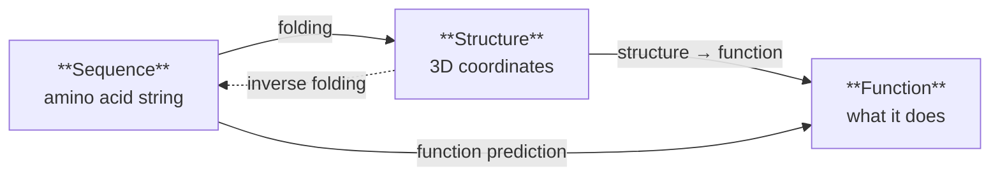
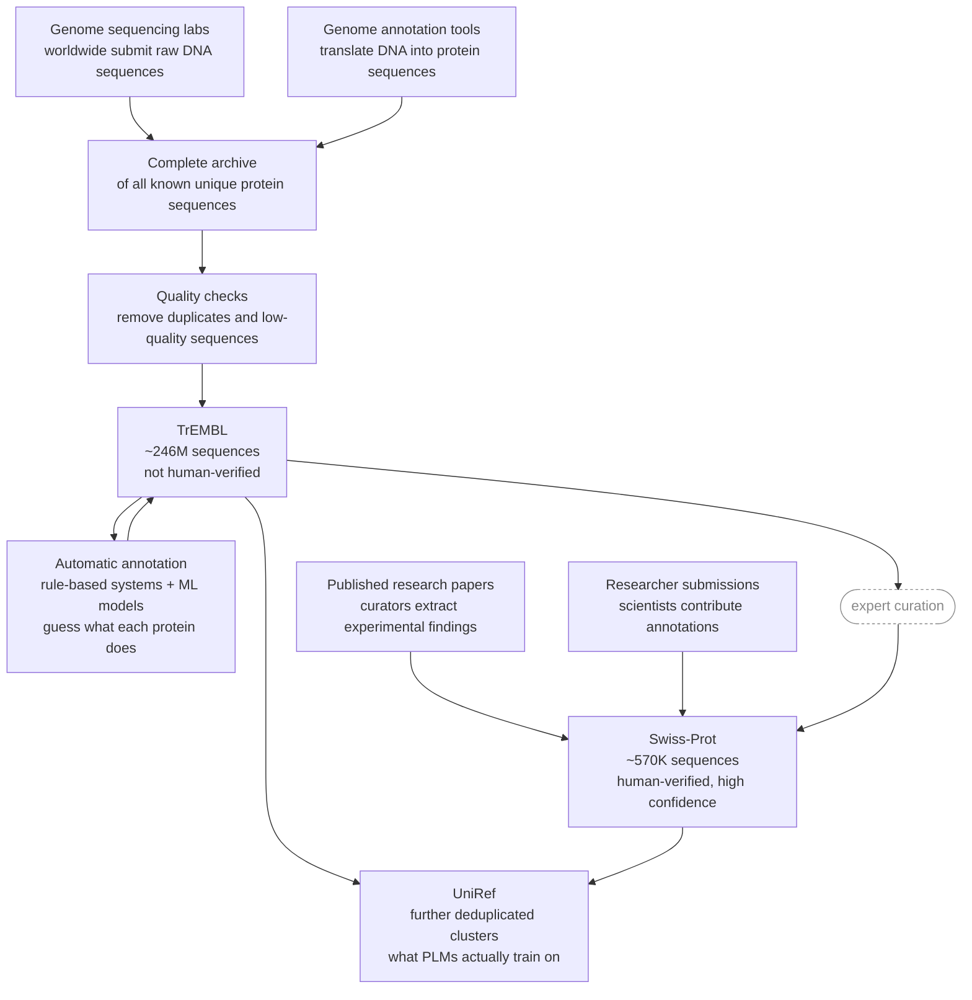
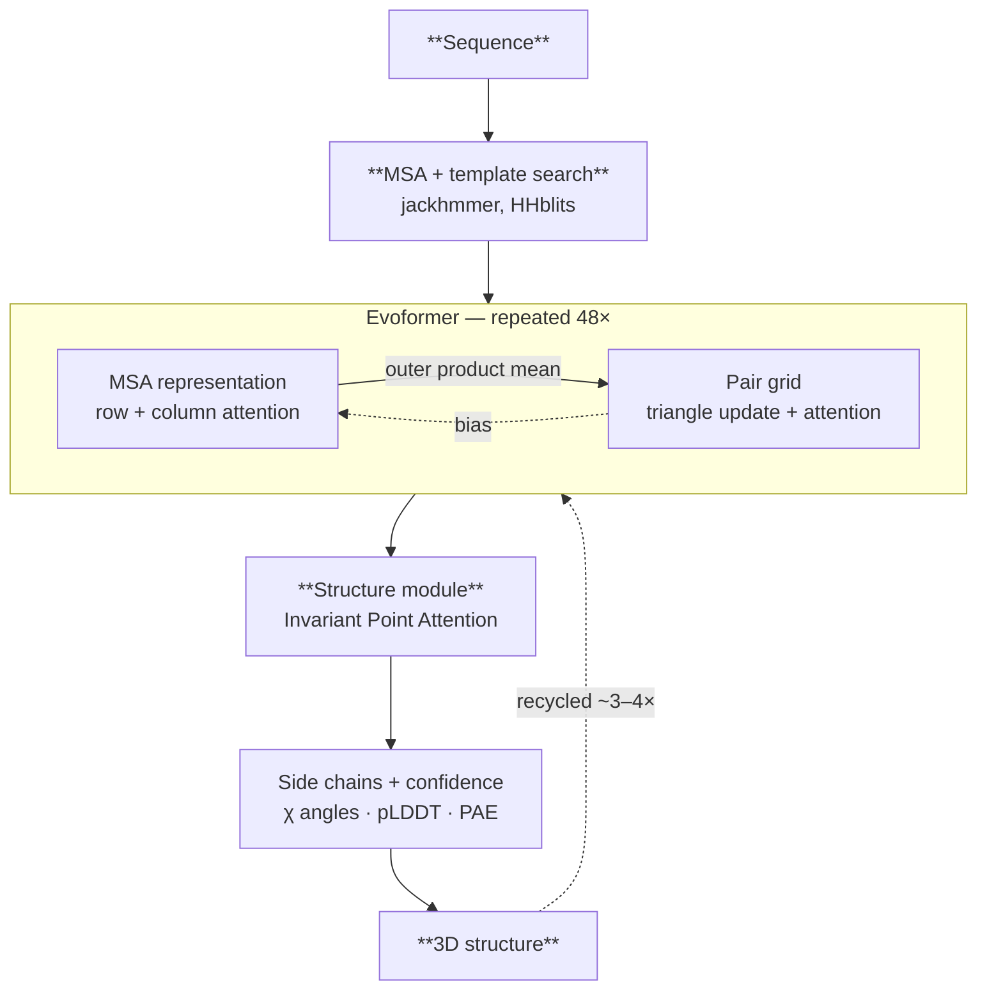
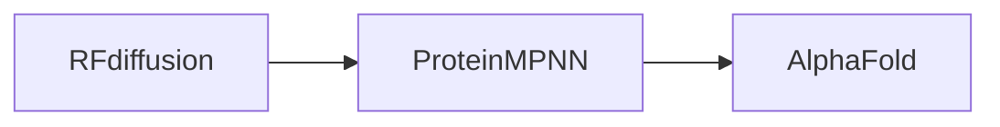
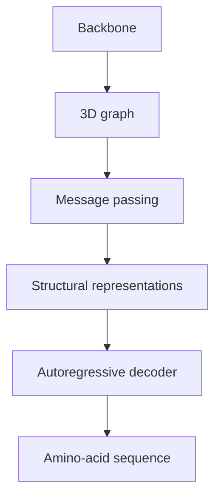
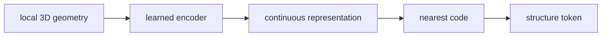
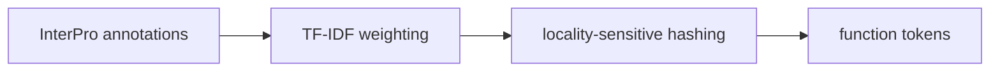
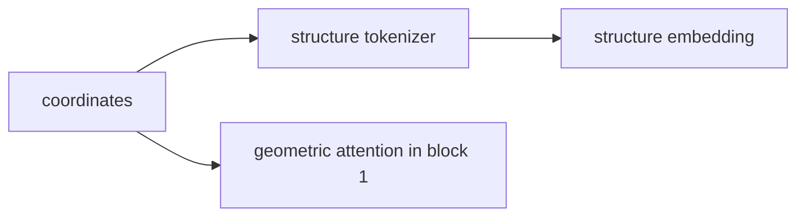

Proteins fold, function, and evolve according to rules written into their amino acid sequence — and it turns out transformers are shockingly good at learning those rules. This post walks through how models like ESM, AlphaFold, and RFdiffusion actually work, from first principles up to the real architectures.

This isn't just a wall of text — nearly every section below has something you can click, drag, or step through yourself. Here's a taste, playing on its own:



> **Not trying to read all 60 minutes of this in order?** Jump to whatever you're actually here for:
> - New to proteins? Start with the [crash course](#crash-course) on amino acids and structure.
> - Just want the models themselves? Skip to [the model landscape](#the-model-landscape).
> - Here for AlphaFold specifically? Go straight to [AlphaFold 2](#alphafold-2-bake-priors-through-architecture) or [AlphaFold 3](#alphafold-3-same-reasoning-different-bets).
> - Want to know how folds get *scored*? See [metrics for protein folding](#metrics-for-protein-folding).
> - More interested in designing proteins than predicting them? Jump to [RFdiffusion + ProteinMPNN](#rfdiffusion--proteinmpnn-solving-inverse-folding).
> - Want the one model that does everything at once? Go to [ESM3](#esm3-one-model-three-modalities).
{: .prompt-tip}

> **Best viewed on a computer.** The interactive widgets throughout this post are click-and-drag heavy and assume a real cursor and a wide screen — they'll be cramped or hard to use on a phone.
{: .prompt-warning}

### Proteins are just like sentences

Proteins are sequences of amino acids, and every protein in living things is simply a unique sequence of these amino acids.  The ordering alone determines the shape and functionality of these proteins.  Now when ML researchers came across this domain, they figured, if we have transformers that create sentences--i.e. sequences of words--why can't we have transformers create proteins, which are sequences of amino acids.

Essentially, we could just swap **words → amino acids**!

Below are two sequences: an English sentence and the first 15 residues of ubiquitin, one of the most studied proteins in biology. Click any token to see what a language model (BERT) and a protein language model (ESM) think about swapping it out.



Both models actually show a similar pattern here. Some positions are flexible, some substitutions make the sentence (or amino acid sequence) still work. Some are locked — replacing the word destroys the grammar of the sentence (analogously, the structure of the protein).

Notice how this illustrates the core problem.  To make a sentence, you must choose and order words in the right way for a target meaning.  To make a protein, you must choose and order amino acids the right way for a target functionality.  The entire problem is to make a model be able to do this effectively!

### Crash course!

Before we dive deep, let's do a crash course on amino acids and proteins!

#### Amino acids

```
        R group
         │
Amino ── Cα ── Carboxyl
         │
         H
```

An amino acid is made of multiple parts.  The **amino group** and **carboxyl group** are the two ends that connect amino acids together into a long chain which is a protein. Every amino acid has the same amino and carboxyl groups, meaning the protein backbone is nearly identical regardless of the sequence.

The **R group** (or side chain) is the only part that differs between amino acids. There are 20 standard amino acids, each with a different R group. These side chains determine each amino acid's chemical properties and interact with one another, ultimately causing the protein to fold into its three-dimensional structure. 

When these amino acids link up to make a protein, each amino acid is called a **residue**.

Finally, the **Cα (alpha carbon)** is the central carbon atom that connects all four components. Since every amino acid contains exactly one Cα atom, structural biology uses its 3D coordinates as a representative ***location for the entire residue***. 

Here's what that skeleton actually looks like in 3D. Drag to rotate the molecule below, and notice how the amino group, α-carbon, and carboxyl group form a fixed, shared backbone — the R group is the only piece hanging off to the side, waiting to be swapped out for one of the 20 options.



> These protein models are rendered via [3Dmol.js](https://academic.oup.com/bioinformatics/article/31/8/1322/213186?login=false) -- super cool library!  Drag around with your mouse to rotate, right click and drag to pan.
{: .prompt-tip}

For example, some R groups are hydrophobic ("water-fearing") and prefer to be buried inside the protein away from water, while others are hydrophilic ("water-loving") and tend to remain exposed on the protein's surface. Some side chains carry positive or negative charges, attracting or repelling one another like magnets, while others can form hydrogen bonds that stabilize specific parts of the structure. The final folded protein is the **result of balancing thousands of these local interactions**, finding a stable three-dimensional arrangement that minimizes the protein's free energy.



Put together, a protein looks like this:

```
      R1          R2          R3
       │           │           │
H2N ─ Cα ─ C ─ N ─ Cα ─ C ─ N ─ Cα ─ C ─ OH
       │           │           │
       H           H           H
```


#### Four levels of structure

Proteins have four levels of structure, each emerging from the one below.

**Primary structure** is just the sequence. A string of amino acids, one after another. MQIFVKTLTG... This is what ESM trains on. This is the "text."

**Secondary structure** is what happens locally when the chain starts to fold. Certain stretches coil into helices, others flatten into sheets. These patterns are driven by hydrogen bonding between nearby residues and are relatively predictable from local sequence chemistry.

**Tertiary structure** is the full 3D shape of a single protein chain — how those helices and sheets pack together in space. This is what AlphaFold predicts. It's determined by long-range interactions between residues that may be hundreds of positions apart in the sequence. This is where it gets hard.

**Quaternary structure** is multiple chains coming together into a complex. Hemoglobin is four chains. AlphaFold3 extended structure prediction to this level.


*The four levels of protein structure. (Source: [wikimedia](https://upload.wikimedia.org/wikipedia/commons/a/a6/Protein-structure.png))*

Below is an interactive showing the different levels.  Click the top buttons to view the different structures.



The key thing to take away: each level emerges from the level below, but in a way that's not locally predictable. The sequence determines everything — but you can't read off the 3D shape by looking at any short stretch of it. You need to understand the whole thing at once. That's why this problem is hard, and you'll see why it's surprising that protein language models learn anything about tertiary structure from sequence statistics alone.

### The different protein modeling problems

Now protein models actually come in many types, each solving a different problem in the space.  We first want to be able to take a sequence and then be able to figure out how the protein will fold in 3D space.  This is the problem the famous AlphaFold models actually solve.  However, just knowing how a protein will fold isn't that useful.  We also need to know how its structure will affect its function—i.e. its behavior.  Finally, there's also an entire space of inverse-folding, where we want to start with what we want the protein to do (and hence what it should look like) and then come up with the sequence of amino acids that can produce this.  You can think of this inverse-folding problem as the thing that will enable us to make synthetic proteins for different applications.



Now a much simpler problem is the **representation problem**.  Before we even try to predict structure, we want to be able to represent amino acid sequences in a rich manner (embeddings).  Just like we have models like BERT for natural language, the protein domain has the same basic requirement: representing these amino acid sequences in a meaningful way that encodes important information about them.  Then we can use this model for downstream tasks, such as folding or function prediction, so they don't have to deal with understanding *what a sequence here means* and instead focus on *what to do with it*.

See below for an animation of how ESM-2 generates embeddings.



Just like BERT, each vector isn't just "what amino acid is this" — it captures context. The three T residues at positions 7, 9, and 12 all get different vectors, even though they're the same character. Same token, different neighbors, different embedding.

All these models are called **Protein Language Models (PLMs)** — transformers trained on protein sequences the same way BERT and GPT are trained on text. Some models combine multiple problems: ESMFold uses PLM embeddings to predict structure directly, skipping the need for a separate folding model. ESM3 goes furthest — it jointly reasons over sequence, structure, and function in a single model, so any modality can prompt any other.

See the table below for an overview—but don't feel nervous if it looks daunting, we'll break it down in this blog post!

| Problem | Models | Input → Output |
|---|---|---|
| Representation | [ESM-1b](https://www.pnas.org/doi/10.1073/pnas.2016239118), [ESM-2](https://www.science.org/doi/10.1126/science.ade2574), [ProtBERT](https://arxiv.org/abs/2007.06225), [ESM-C](https://evolutionaryscale.ai/blog/esm-cambrian) | Sequence → Embeddings |
| Folding | [AlphaFold2](https://www.nature.com/articles/s41586-021-03819-2), [RoseTTAFold](https://www.science.org/doi/10.1126/science.abj8754), [AF3](https://www.nature.com/articles/s41586-024-07487-w) | Sequence → 3D coordinates |
| Folding (from embeddings) | [ESMFold](https://www.science.org/doi/10.1126/science.ade2574) | PLM embeddings → 3D coordinates |
| Function prediction | [ESM-2 + head](https://www.science.org/doi/10.1126/science.ade2574), [SaProt](https://openreview.net/forum?id=6MRm3G4NiU) | Sequence → Function |
| Inverse folding | [ProteinMPNN](https://www.science.org/doi/10.1126/science.add2187), [RFdiffusion](https://www.nature.com/articles/s41586-023-06415-8) | Structure → Sequence |
| Multimodal | [ESM3](https://www.science.org/doi/10.1126/science.ads0018) | Any → Any |

### Hold up, proteins are NOT like sentences

So far, I've projected this protein modeling problem as being just like NLP.  I'm sorry to say that I may have actually severely overstated that :P.  **Turns out, there are a lot of difficult challenges in this domain.**

#### 1. The protein language only has 20 words

There are only 20 amino acids in nature.  So every single protein is a sequence of these 20 amino acids.  This means our protein models only have a vocabulary size of **20** tokens, compared to hundreds of thousands of tokens in GPT-4!



> Technically 22 amino acids occur naturally — selenocysteine and pyrrolysine are rare, genetically-encoded exceptions found in a handful of organisms — and most models also reserve a token for unknown/non-standard residues (often X). The "20" convention holds for the vast majority of sequence data and is what virtually all PLMs are trained on.
{: .prompt-warning}

#### 2. Small errors yield catastrophic results

A single swap of an amino acid from Glutamate to Valine causes the hemoglobin protein (which is used to carry oxygen by red blood cells) to become unable to carry oxygen.



#### 3. No ground truth at scale

There are three main datasets in this space: [UniProt](https://www.uniprot.org/), [Protein Data Bank (PDB)](https://www.rcsb.org/), and [AlphaFold Database](https://alphafold.ebi.ac.uk/).  Let's go over what each of those contributes.

##### UniProt: tons of amino acid sequences

UniProt contains a bunch of amino acid sequences of different proteins—about ~250 million sequences in fact!  This is awesome—you can train models to predict the next amino acid (self-supervised learning) really easily at scale.  The problem is that not all of these sequences have *labels*—what each sequence actually corresponds to in terms of the protein's function.  This means it is really difficult to train models to predict downstream tasks, such as whether a mutation will cause a disease, or a protein's enzyme activity (i.e. how well it accelerates a reaction).  Of all the sequences only around 550,000 sequences have been manually curated by expert biologists — the rest are automatically annotated by rule systems.



Protein sequences are collected from genome sequencing labs worldwide and flow into TrEMBL, a massive database of ~246 million sequences that are automatically annotated by rule-based systems and ML models. A tiny fraction — around 570,000 — gets promoted to Swiss-Prot through expert human curation, where annotations are verified against published experimental evidence. Both feed into UniRef, a deduplicated version of the database that protein language models actually train on.







##### Protein Data Bank: dataset of experimentally verified structures

The PDB has around 200,000 experimentally verified examples of protein structures.  This is great—you really can't get a more accurate dataset than this.  The problem, though, is that 200,000 pales in comparison to the millions of amino acid sequences out there.  We really can't train a large model on just this 200,000 datapoints.  There is a whole lot more amino acid sequences out there that we don't know the shape for.

##### AlphaFold Database

The AlphaFold DB now contains more than 241 million predicted structures, essentially covering all of UniProt. This sounds like it closes the gap completely—and in some ways it does.  But the caveat is that these are *predicted* structures from their AlphaFold model.  These predictions could be wrong, making this not a gold-standard dataset.

As you can see, there is a major data shortage in this domain—despite being able to sequence the genome, which leads us to be able to store millions of amino acid sequences, the data of how these sequences behave as proteins simply isn't there at scale.

##### CASP: a competition, not a dataset

So how do we know any of these predicted structures — from AlphaFold or anyone else — are actually trustworthy? This is exactly the question **CASP (Critical Assessment of protein Structure Prediction)** was built to answer. 

CASP is a competition held every two years, where organizers work with biology labs around the world to identify target proteins that are being actively solved experimentally but haven't been published yet (i.e., no one publicly knows how it folds).  Organizers compile a set of proteins to test the ML models on.  At submission time these answers aren't known by the model-makers so this serves as an unbiased way of measuring model performance, where the test examples aren't leaked into the training data for these models.

> **Extra info on CASP:** It's run by an independent, volunteer, worldwide research community — not a company — and has taken place every two years since 1994. Targets span the full difficulty spectrum, from routine sequences to genuinely novel folds with no close relatives in the PDB, so predictors are scored across easy and hard cases alike. CASP is also where the field's structure-comparison metrics were popularized — TM-score (covered below) and GDT-TS are the same metrics used to rank CASP submissions. And CASP isn't just for folding: recent rounds also run tracks for complexes and function prediction, tracking the field far beyond single-chain structure. CASP14 (2020) is the round where AlphaFold2 crossed a score threshold widely regarded as "solving" the single-chain structure prediction problem.
{: .prompt-info}

#### 4. Verifying is difficult

Building off from the AlphaFold database discussion, even if you train a model to predict how a protein folds/behaves (or inversely find a predicted sequence given a target behavior), you need to then synthesize it in the lab in order to verify it actually works.  Contrast this with just having a human read a sentence from GPT to verify it makes sense.  Verifying PLM outputs is a physical, expensive task.  We've seen how much effort goes into CASP, and that serves as a testament for how hard verification is.

### Metrics for protein folding

So far we've discussed generally how proteins fold, challenges in the protein modeling space, and datasets within the field.  Before we dive into the models, we need to talk about one more thing: scoring model predictions.  There's quite a lot of science that goes into it.

#### Template modeling (TM) score

The TM score is, essentially, 

> Rotate the predicted protein until it lines up as well as possible. For every residue, give almost full credit if it's close, partial credit if it's somewhat off, and almost no credit if it's far away. Average those credits over the whole protein.

How is this expressed mathematically?  Like this:

$$
\mathrm{TM\text{-}score}
=
\max\left[
\frac{1}{L_{\mathrm{target}}}
\sum_{i=1}^{L_{\mathrm{common}}}
\frac{1}{1+\left(\frac{d_i}{d_0(L_{\mathrm{target}})}\right)^2}
\right],
$$

where,

$$
d_0(L_{\mathrm{target}}) = 1.24\sqrt[3]{L_{\mathrm{target}} - 15} - 1.8.
$$

Let's break down what all this means.

Fundamentally we want to compare pairs of residues in predicted and actual structures and aggregate the errors in a score.  $d_i$ is the distance between two corresponding residues.  We want to normalize this distance, so we divide this by $d_0(L_{target})$, which is a function of how long our target protein is ([empirically derived](https://pubmed.ncbi.nlm.nih.gov/15476259/)).  Why do we do this?  This is because if not, longer proteins will almost always look worse: more residues with small errors will add up over longer proteins.  A way to reason about this is to imagine two sticks, each bent by the same small angle.  The longer the sticks are, the further apart their ends end up, even though the bend itself is just as slight.  

{:.light}
{:.dark}
*A short stick and a long stick bend by the same small angle. The short stick's endpoints end up close together, but the long stick's endpoints end up far apart — same bend, very different raw distance error.*

To smoothen this out, this $d_i / d_0(L_{target})$ is put as input in the $y = 1/(1+ x^2)$ graph.



Notice how this curve reaches 1 when the distance (error) approaches 0, and approaches 0 when the distance gets large.  The curve also doesn't blow up with large inputs.  Together,

$$\frac{1}{1+\left(\frac{d_i}{d_0(L_{\mathrm{target}})}\right)^2}$$

is a way of taking each error distance and weighting the scores in a normalized manner.  Close residues are given score of near 1, and the rest are zeroed out, all while keeping in mind that we need to de-bias against long proteins.

We compute the average of the scores by adding them up and then dividing by $L_{target}$, the length of the actual protein.  We use $L_{target}$ and not $L_{common}$ because if the predicted protein has different amino acids, we don't even want to allow that to contribute to the score.

Finally, $\max$ here ensures the expression is evaluated when the two structures (predicted and actual) are most aligned with each other (think of how we align two sticks to be parallel to see which is longer), since any misalignment only lowers the score.

#### Long-range contact precision

Contact precision is defined as follows: for a protein of length $L$, take the top $L$ predicted contacts — pairs of amino acids indexed $i, j$ that the model is most confident are within 8Å.  The fraction of such pairs that are actually contacts is precision.  "Long-range" qualifies this metric as only picking pairs that are far apart (i.e. $\|i - j\| \geq 24$).  Why do they measure only long range pairs?  Because short-range contacts (like adjacent amino acids) are trivially connected since the backbone (i.e. the sequence ordering) connects them.  Even close amino acid contacts only contribute to secondary structure, meaning if we want to actually measure the difficult tertiary and quaternary structure prediction, we need to sample longer range pairs to get those examples.

This answers:

> "When the model is most confident, how often is it right?"

> Why 24 as the magic number?  This was also [empirically found](https://pmc.ncbi.nlm.nih.gov/articles/PMC3823628/) and now everyone agrees as this as the standard.
{: .prompt-tip}


#### Model confidence: pLDDT and PAE

Now these metrics go over how we can get model confidence when model folds.

##### pLDDT: Local Distance Difference Test

The naive approach would be to treat some internal network activation as a confidence score. But there is no reason a raw activation should correspond to anything meaningful. Instead, AlphaFold is trained to predict a well-defined quantity: **lDDT** (Local Distance Difference Test).

lDDT measures **local** structural accuracy. For each residue, it compares the predicted structure with the true structure by checking whether the distances to nearby atoms (within roughly 15 Å) are preserved. Because it only looks at a residue's local neighborhood, a residue can have a high lDDT score even if another part of the protein is positioned incorrectly.  Essentially, lDDT asks,

> For each residue, look at the other residues sitting close to it. In the model's predicted structure, do those neighbors sit the same distance away as they do in the real, experimentally-determined structure?

During training, the true structure is available, so the correct lDDT score can be computed for every residue. The model learns to predict these scores from many examples. At inference time, the true structure is unknown, so instead of computing lDDT, the model estimates what the lDDT score would be if the true structure were available. This predicted score is called **pLDDT**, and it ranges from 0 to 100 for each residue.

Here's a real AlphaFold2 prediction — human lysozyme C — with its pLDDT scores baked directly into the structure (AlphaFold stores per-residue pLDDT in the B-factor column, which is exactly what's driving the coloring below). Toggle between AlphaFold DB's four discrete confidence bins and a continuous gradient over the same underlying values, and notice which parts of the structure the model is least sure about.



##### PAE: Predicted Aligned Error

While pLDDT tells you how each residue is positioned within its locality, it cannot tell you, for example, whether a pair of residues on opposite sides of the protein are positioned correctly.  Predicted Aligned Error measures, for each residue pair $i, j$ in the protein, 

> If residue $j$ is fixed in place, how accurately do I know where residue $i$ should be?

This too, is learned by the model as part of its output.  It is important to use both pLDDT and PAE since a protein can have high pLDDT everywhere — i.e. individual residue neighbors are positioned correctly with each other, but one section of the protein as a whole is wrongly positioned with respect to another.

The best way to visualize / interpret PAE is through a grid, like what's below:

Take a toy 6-residue protein made of two contiguous domains: residues 1–3 form domain A, residues 4–6 form domain B. Since each domain folds rigidly on its own, any pair of residues *within* the same domain gets a confident, low-PAE score — even residues 4 and 6, which are far apart in sequence number but sit in the same rigid block. Pairs that straddle the two domains get a high-PAE, uncertain score instead, since the domains' relative orientation is exactly what's hard to pin down — even residues 3 and 6, which are close together in sequence number. Sequence distance and PAE confidence are simply not the same thing.

{:.light}
{:.dark}
*Diagonal blocks (same domain) are dark blue — low PAE, confident. Off-diagonal blocks (different domains) are amber — high PAE, uncertain. What matters is domain membership, not how close two residue numbers are.*

> Take a look at [this resource](https://pae-viewer.uni-goettingen.de/) from University of Göttingen to see an interactive view of PAE.  **It has a visual for PAE in a similar style to the other ones in this blog**
{: .prompt-tip}


### Metrics for physical/energetic plausibility

So far, we've gone through metrics that are based on knowing the correct answer -- i.e. the way the protein truly folds.  However, there are other ways to get an idea if a predicted protein fold is valid or not.  This is all based on heuristics derived from science, such as:

* Proteins should fold in a way where they are at a low energy state (as that's stable)
* Atoms should not collide with each other, as that's impossible

#### DOPE (Discrete Optimized Protein Energy)

[DOPE](https://onlinelibrary.wiley.com/doi/10.1110/ps.062416606) is a statistical potential — meaning it's not derived from physics, but instead learned from patterns observed across thousands of known, experimentally solved protein structures in the PDB.  DOPE operates by looking at a pair of atoms, and asking "How often in nature do these two atoms sit at this distance."  Now, since this is $O(N^2)$ for all atom pairs, DOPE is really just calculated for atom pairs less than 15Å apart.

$$
\mathrm{DOPE} = -k_B T \sum_{i<j} \ln\left[\frac{p(r_{ij})}{p^{rs}(r_{ij})}\right]
$$

where:

- $r_{ij}$: the distance between two atoms in our model. This is the raw error signal — just how far apart these two atoms actually ended up.
- $p(r_{ij})$: we don't judge this distance in isolation. Instead we ask, across thousands of real, experimentally solved protein structures, how often this specific pair of atom types shows up at this specific distance. This is empirically derived, not assumed.
- $p^{rs}(r_{ij})$: this is the reference state. Even with zero chemistry involved, distances aren't equally likely — imagine scattering two random points inside a ball the size of a folded protein: pure geometry alone makes very short and very long distances rare, and medium distances common. We compute this purely geometric baseline so it can be divided out, leaving behind only the real chemical preference.
- $k_B$: Boltzmann's constant. It shows up here simply to keep the formula in the same "shape" as the classic Boltzmann relation $p \propto e^{-E/k_BT}$, letting us convert a probability ratio into something **that behaves like an energy.**
- $T$: a fixed reference temperature. There's no real simulation happening, no actual thermal system — this is just carried along to complete the inverse-Boltzmann conversion from probability into a pseudo-energy scale.



> Remember: proteins want to be at the most stable state, meaning at the lowest energy level.  Predicted configurations with high energies are likely not possible in nature.
{: .prompt-tip}

#### MolProbity Score

MolProbity combines several independent geometric sanity checks into a single composite score.

##### Clash score
Every atom has a physical size (its van der Waals radius — basically "how much space it takes up before it starts repelling neighboring atoms"). A clash happens when two atoms that aren't bonded to each other get placed closer together than physics allows — their electron clouds would be overlapping, which is energetically catastrophic and never happens in a real, stable protein.

Clash score is simply: the number of serious atomic clashes per 1,000 atoms in the structure. Lower is better — a good experimental structure typically has a clash score in the single digits; a bad or unrefined model can have scores in the dozens.

The reason it's normalized "per 1,000 atoms" rather than as a raw count is the same reason TM-score divides by protein length: bigger proteins have more atoms and more opportunities for clashes, so you need to normalize to compare a 100-residue protein fairly against a 500-residue one.

##### Ramachandran outliers

Remember from the crash course: every amino acid shares the same backbone — amino group, Cα, carboxyl group — strung together into a chain. That backbone isn't rigid. Two of its bonds can rotate freely: the N–Cα bond and the Cα–C bond, called φ (phi) and ψ (psi) respectively. Everything else in the backbone (the peptide bond linking one residue to the next) is locked flat by resonance, so phi and psi are really the only two knobs each residue has to turn. Get enough residues turning their knobs in a coordinated way and you get a helix; turn them a different coordinated way and you get a sheet.

You'd think two continuous angles, each free to spin 360°, would give you a huge space of possible shapes per residue.  However, most (φ, ψ) combinations jam backbone atoms into each other, the same steric-clash problem from the clash-score section, just visualized locally instead of aggregated over a whole structure. **G.N. Ramachandran** [worked this out in 1963](https://pubmed.ncbi.nlm.nih.gov/13990617/), before anyone had a computer that could fold a protein: plot every residue's φ against its ψ, and the allowed conformations cluster into a handful of tight islands, surrounded by a sea of geometrically impossible space. That plot is now the standard first-pass sanity check for any modeled or solved structure — it's literally one of the three ingredients baked into the MolProbity score you already met. Below, you can drag a point around that space yourself and watch a real backbone fragment twist to match, including the two outliers — glycine and proline — that live by different rules.



##### Sidechain rotamer outliers

Side chains (i.e. R groups) rotate too.  Lysine, for example, has a whole tail of rotatable bonds flapping around, each one called a chi angle (χ1, χ2, and so on, counting outward from Cα).



Here's the interesting part: those bonds don't spin freely. Same idea as φ/ψ — they cluster into a few preferred positions, roughly three per bond, about 120° apart. A side chain sitting in one of those preferred spots is called a rotamer, and — like the Ramachandran regions — the "preferred" list isn't derived from theory, it's just what shows up over and over in real, solved structures.

A **rotamer outlier** is a side chain that missed all of those spots. Nothing's necessarily clashing — it's just a shape real proteins basically never use. It's the third thing MolProbity checks, alongside clashes and backbone angle: not "are atoms touching," but "does this specific twist actually happen in nature." 


### The model landscape



#### ESM-1b: what does masked language modeling learn from protein sequences?

ESM-1b takes the standard BERT objective of masked language modeling (based on RoBERTa architecture) used in NLP and applies it to proteins.  The idea is to have 15% of the residues (amino acids) masked at random, and have the model learn to fill in the blanks.  This is an attempt to solve the *representation problem*: if a model can fill in the missing amino acids, it probably means that it has a good idea of how proteins work.

However, like BERT, this is an *embedding model*—it can't predict specifically protein structure or anything useful on its own.  Instead, researchers attached probes (i.e. extra additions to the network) and fine-tuned ESM-1b for specific tasks.  One task is *unsupervised contact prediction*.  This is where a logistic regression probe (with the rest of the weights frozen) is attached to the ESM model and trained on 20 protein structures.  For a given pair of residues (i, j), it finds the probability that they are in physical contact in 3D space.  Concretely,

```
input:  attention[head_1][i][j], attention[head_2][i][j], ... attention[head_600][i][j]
output: P(distance(i,j) < 8Å)
```

Note that Å is an Angstrom, or $10^{-10}$ meters, where 8Å is a close enough distance to assume the two residues contact each other.


This is also the answer to a question from the very start of this post: why should a transformer trained only to fill in masked amino acids — with no structural supervision at all — end up learning anything about how a protein folds? The masked-language-modeling objective forces the model to predict a residue from everything else in the sequence, and the best way to do that is to pick up on **coevolution**: pairs of positions that mutate together across evolutionary history because they're in physical contact and constrain each other structurally. That coevolutionary signal is learnable through self-attention, and it shows up directly in the attention maps themselves — which is exactly what the unsupervised contact-prediction probe above is reading out.

Below is a real ESM-1b forward pass over ubiquitin, no fine-tuning, with attention heads ranked by how well they predict real contacts. Some heads are near-random; others land startlingly close to the true contact map, just from being trained to fill in the blanks.

What matters is whether a head's attention shows up **off the diagonal**. On-diagonal attention is trivial — adjacent residues are chemically bonded, so of course they're relevant to each other. Off-diagonal attention connects residues far apart in sequence, and the only reason that would matter is if the chain folded back and put them physically close in 3D.  This means the model has internally learned, to some extent, how a protein folds just by looking at the amino acid sequence.



Now it might be a bit confusing visualizing what the contact map on the left actually means.  See below for how to interpret the graph.

Look at the real contact map on the left of that widget. Cell $i,j$ indicates whether residue $i$ is connected to residue $j$. The main diagonal isn't a single line — there's a second, thinner line running right alongside it. Pick "Helix turn" below to see why: the alpha helix hydrogen-bonds residue $i$ to residue $i{+}4$ as it coils, so every residue along the helix ends up close to one a few positions ahead of it. That repeating offset is the second band. "Sheet pairing" shows a different case: two stretches of sequence tens of residues apart, pulled next to each other because the chain folds back on itself, showing up as a contact far off the diagonal.



#### ESM-2 & ESM-C: do scaling laws hold for proteins?

ESM-2 is basically ESM-1b's architecture scaled up. It comes in six sizes, from 8M parameters up to 15B.

But does scaling actually work here? Drag the slider through all six real checkpoints and watch what happens to contact precision and structure prediction quality. The published numbers are pretty clear about it: performance shoots up early, then flattens out hard. Going from 3B to 15B (a 5x jump in parameters) barely moves the needle compared to what that same 5x jump did way back at 8M to 35M.


Maybe the 15B ESM-2 model didn't actually hit a limit—it just didn't see enough data. Researchers at BioMap and Tsinghua University [(paper)](https://proceedings.neurips.cc/paper_files/paper/2024/file/8066ae1446b2bbccb5159587cc3b3bcc-Paper-Conference.pdf) tested this. Every ESM-2 size was trained on the same ~1 trillion tokens: roughly 22 billion unique tokens repeated 45 times. Their analysis suggested that compute would've been better spent on a larger model with fresher data. They trained a **10.7B model on ~260B mostly fresh tokens**, which beat ESM-2 3B and matched or beat ESM-2 15B on most benchmarks.

The ESM team later took a similar approach with **ESM C**, released in December 2024, training each size on **6.2T tokens** instead of ESM-2's ~1T. The result is essentially the flattening curve from above, fixed: ESM C 300M matches ESM-2 650M, 600M rivals 3B, and 6B beats every ESM-2 model. In other words, **ESM-2 may not have hit a model-size limit—it may have hit a data limit.** ESM C also deliberately overtrained its smaller models, since spending more on training a cheap-to-run model can be worthwhile in practice.

#### AlphaFold 2: bake priors through architecture 

Now we'll talk about AlphaFold 2, the huge breakthrough model in this space.  To understand it best, let me show you how it looks like from a high level.

AlphaFold2 fundamentally splits the task of protein folding into two steps:

1. Generate a good representation of which residues connect to which (Evoformer)
2. Iteratively generate the protein 3D structure given the representations (Structure module)

Let's first talk about step 1.  This part of AlphaFold is called the **Evoformer**.  It works by keeping two representations of the same protein side by side, and repeatedly updates each one using the other — the same block, repeated 48 times.

The first representation is the **Multiple Sequence Alignment (MSA)**.  MSA has similar protein sequences from different organisms lined up.  This is used by the model to detect evolutionary / coevolutionary patterns (just like what ESM-1b tried in its pretraining).  Essentially, imagine lining up the amino acid sequences for a human, a dog, and a cat.  If positions 1 and 3 mutate together across species, there is a good chance they do so because they are connected.  This is what AlphaFold leverages to enrich its representations.

The second is the **pair grid:** one cell per pair of positions, and it starts out holding almost nothing, just how far apart two positions sit in the sequence. This is AlphaFold's place where it writes its opinion for each pair combination of residues, which it later uses to actually predict how the protein folds.  

Everything in this section is these two forms trading information back and forth. Take a look at both below.



Let's start with the MSA. A residue's letter on its own doesn't say much. Knowing position 1 is Methionine doesn't tell you what role it plays. What matters is how position 1 relates to the residues around it, and those relationships aren't all equally informative — some carry real signal, some are close to noise.

This is what attention computes: for a given residue, how relevant is each other residue, and by how much. Row attention applies this within a single sequence — for one position, look at every other position in that same row and score how relevant each one is. It doesn't score relevance from content alone, either: the pair grid already has an opinion about each pair, built up from earlier blocks, and that opinion gets folded in as a bias term alongside the raw content comparison.



Column attention looks at the same alignment along the other axis. Fix one position, and compare what every species has there. Dog has a K at position 2. On its own, that tells us nothing. What tells us something is what the other species have at that exact same spot: if they agree, the agreement is itself a signal that this position is constrained; if they vary freely, the position probably isn't under much selective pressure. Column attention compares every species' version of a position to every other, and uses how much they agree to decide how much each one should inform the rest.



Row and column attention update the MSA, using the MSA. The pair grid is still sitting there almost empty. Outer product mean is the first mechanism that actually writes real values into it.

Here's the reasoning. Two positions that sit close together in the folded protein can't mutate independently forever — if one changes, the other tends to change with it, to keep the structure intact. Across enough species, that constraint shows up as correlated variation. But the signal is thin, and it's scattered across every row of the alignment rather than sitting in any one place. Outer product mean's job is to gather that scattered signal into something concentrated enough to see.

The mechanism: take each pair of positions' vectors, multiply them together species by species, then average the results. Averaging is what makes this work. Do it over species that vary together, and the average stays sharp. Do it over species that vary independently, and the average washes out toward nothing.



Row attention, column attention, and outer product mean all move information between the MSA and the pair grid. None of them let two pair grid cells check each other. Triangle update is where that happens — a cell gets updated using other cells, not the MSA.

The problem is that pairwise relationships are connected: information about $i \leftrightarrow k$ and $k \leftrightarrow j$ should be useful when reasoning about $i \leftrightarrow j$. Triangle update is the mechanism that lets pair representations communicate through a shared third residue.

For a target cell $z_{ij}$, the model looks at every possible third residue $k$. It combines $z_{ik}$ and $z_{kj}$ to form a message about $i \leftrightarrow j$, then sums those messages over all $k$:

$$
z_{ij} \leftarrow z_{ij} + \sum_k f(z_{ik}, z_{kj})
$$

In other words, instead of treating every pair independently, the model can reason about **relationships between relationships**:

$$
(i,k) + (k,j) \rightarrow (i,j)
$$

That's why it's called a **triangle update**: every (k) creates a triangle (i-k-j), and each triangle provides information that can update the (i,j) edge.


Explore this below: pick a cell, and see how it is updated through triangle update.



> - Each cell above is one number, but a real pair grid cell is a 128-dimensional vector — nothing here is literally measured in Ångströms.
> - The triangle inequality is why this update exists, not what it computes: there's no distance check, just cell (i,k) and cell (k,j) combined through learned weights and summed into cell (i,j).
{: .prompt-warning}


AlphaFold2 calls this the **triangular multiplicative update**, and runs two variants — one using outgoing edges, one using incoming edges. Here's the outgoing-edge version, for pair grid cell $z_{ij}$:

$$
a_{ik} = \sigma\big(W_{a_1}\,\mathrm{LN}(z_{ik})\big) \odot \big(W_{a_2}\,\mathrm{LN}(z_{ik})\big)
$$

$$
b_{jk} = \sigma\big(W_{b_1}\,\mathrm{LN}(z_{jk})\big) \odot \big(W_{b_2}\,\mathrm{LN}(z_{jk})\big)
$$

$$
z_{ij}^{\text{new}} = \sigma\big(W_{g}\,\mathrm{LN}(z_{ij})\big) \;\odot\; W_{\text{out}}\,\mathrm{LN}\!\left(\sum_{k} a_{ik} \odot b_{jk}\right)
$$

where $\mathrm{LN}$ is LayerNorm, $\sigma$ is the sigmoid function, $\odot$ is elementwise multiplication, and every $W$ is a learned linear projection.

A few things worth tracing back to the interactive above:

- $a_{ik}$ and $b_{jk}$ are gated, projected versions of cells $(i,k)$ and $(k,j)$ — not their raw values. This is the "128-dimensional vector, not a distance" fact from the warning above, made concrete: content only enters through these learned projections.
- $\sum_{k} a_{ik} \odot b_{jk}$ is exactly the sweep this widget animates — combine and sum over every third vertex $k$.
- The leading $\sigma(W_g \mathrm{LN}(z_{ij}))$ term is a gate on the *old* value of $(i,j)$, deciding how much of the summed update actually gets written in versus how much of the original cell survives.
- The incoming-edges variant has the same shape, just built from $z_{ki}$ and $z_{kj}$ instead of $z_{ik}$ and $z_{jk}$.

That's the whole mechanism. Everything else in the Evoformer block moves information between the MSA and the pair grid; this is the only step where the pair grid checks itself.




Triangle update pools. For cell $(i,j)$, every third vertex $k$ contributes a message $m_k$, and the update combines them all:

$$
m_{ij} = m_1 + m_2 + m_3 + m_4
$$

There's no mechanism asking which $k$ matters more. Every triangle contributes to the same pooled message, and $(i,j)$ receives the result all at once.

Triangle attention adds that missing question: **which $k$ is actually relevant to $(i,j)$?** Instead of giving every candidate the same treatment, it lets them compete for influence:

$$
m_{ij} = 0.05\,m_1 + 0.10\,m_2 + 0.80\,m_3 + 0.05\,m_4
$$

Now $k_3$ dominates the update, while the others contribute very little. The weights aren't hand-picked. They're produced by attention.

For the target cell $z_{ij}$, the model first turns it into a **query**:

> *What kind of relationship am I looking for?*

Each candidate $z_{ik}$ becomes a **key**:

> *What kind of relationship do I represent?*

The query and each key are compared, while the third edge $z_{jk}$ contributes an additional bias:

$$
s_{ijk} = q_{ij} \cdot k_{ik} + b_{jk}
$$

So each $k$ gets its own score:

> *Does the $i \leftrightarrow k$ relationship look relevant to what $i \leftrightarrow j$ is looking for, and does the $j \leftrightarrow k$ relationship support it?*

The scores are then passed through a softmax **across all $k$'s together**, turning them into competing weights. A candidate with a high score gets more influence; increasing its share necessarily reduces the relative share of the others.

That's the key difference: **triangle update pools all the triangles; triangle attention lets the triangles compete for influence.**

Try it below: pick a cell, and see which triangles win the competition. The widget's "q·k" is $q_{ij}\cdot k_{ik}$ and "bias" is $b_{jk}$, so the score you see building up in each row is $s_{ijk}$ above.



> - q&middot;k in the widget stands in for a real dot product between projected vectors; here both are simplified to one scalar, so it's just their product.
> - The query doesn't gate the result after the fact — it drives the competition up front. $(i,j)$'s own value decides what gets compared against, which is why q&middot;k depends on the target too, not just the candidate.
{: .prompt-warning}


AlphaFold2 calls this **triangular self-attention**, and like triangle update it runs two variants — attending around the starting node (row) or the ending node (column). Here's the starting-node version, for pair grid cell $z_{ij}$ attending over every $k$ in row $i$:

$$
q_{ij} = W_Q\,z_{ij} \qquad k_{ik} = W_K\,z_{ik} \qquad v_{ik} = W_V\,z_{ik} \qquad b_{jk} = W_B\,z_{jk}
$$

$$
s_{ijk} = \frac{q_{ij}^{\top} k_{ik}}{\sqrt{d}} + b_{jk}
$$

$$
\alpha_{ijk} = \operatorname{softmax}_k\big(s_{ijk}\big)
$$

$$
z_{ij}^{\text{new}} = \sum_{k} \alpha_{ijk}\, v_{ik}
$$

where $d$ is the key dimension and every $W$ is a learned linear projection.

A few things worth tracing back to the interactive above:

- $z_{ij}$ only enters through $q_{ij}$. It sets what the pair is looking for; it never touches the output directly. Everything in $z_{ij}^{\text{new}}$ comes from the $v_{ik}$'s.
- $b_{jk}$ is projected from $z_{jk}$ — the third side of the triangle, the one edge connecting the two positions neither $z_{ij}$ nor $z_{ik}$ share. This is the piece that makes it *triangle* attention rather than plain self-attention.
- $\alpha_{ijk}$ is one softmax across every $k$ in the row at once, so the weights are forced to compete — raising one lowers the others. That's the difference from triangle update's sum, where every $k$ contributes independently and none of them compete for influence.
- The ending-node variant has the same shape, attending over column $j$ instead of row $i$: keys and values come from $z_{kj}$, and the bias comes from $z_{ki}$.

Same three inputs as triangle update — $z_{ij}$, $z_{ik}$, $z_{jk}$ — but here they're split into a query, a set of keys and values, and a bias, and combined through competition instead of a sum.




The Evoformer has spent all this time building the pair representation: for every pair of residues, it has learned what their relationship might look like. But a grid of pair representations isn't a protein structure. At some point, AlphaFold has to actually put the residues somewhere in 3D.

That's the job of the **Structure Module**. The key idea is that it doesn't predict every coordinate independently. Instead, it gives each residue a **rigid frame**:

$$
T_i = (R_i, t_i)
$$

Think of this as a little coordinate system attached to residue $i$: $R_i$ says which way it's pointing, and $t_i$ says where it is. The Structure Module repeatedly adjusts these frames until the whole protein settles into a plausible 3D arrangement.

The interesting part is how it decides what each residue should pay attention to. That's **Invariant Point Attention (IPA)**.


IPA is attention made up of three components:

1. Scalar features: do their learned representations match?
2. Pair information: what does the model already know about this pair?
3. 3D geometry: are their learned points close in space?

For each residue $i$, IPA maintains a local **frame** ($T_i$): essentially a position and orientation that defines how to place points associated with that residue into 3D space. A learned query point $q_i^p$, for example, is transformed into global coordinates as

$$
T_i(q_i^p).
$$

Likewise, residue $j$'s key point becomes

$$
T_j(k_j^p).
$$

We can then compare the two points by their distance:

$$
\left\lVert T_i(q_i^p)-T_j(k_j^p) \right\rVert.
$$

The important thing is that this distance is **invariant to moving or rotating the entire protein**. If we translate the protein, the translation cancels out; if we rotate it, distances are preserved. So IPA can reason about the protein's geometry without caring about the arbitrary coordinate system used to represent it.

None of this is abstract — it runs on real atoms. Step through it on an actual structure below.



This geometric information becomes a third term in the attention score:

$$
a_{ij}
=
\operatorname{softmax}_j
\left(
\underbrace{\frac{q_i\cdot k_j}{\sqrt{c}}}_{\text{scalar attention}}
+
\underbrace{b_{ij}}_{\text{pair representation}}
-
\underbrace{
\frac{\gamma}{2}
\sum_p
\left\lVert
T_i(q_i^p)-T_j(k_j^p)
\right\rVert^2
}_{\text{3D point attention}}
\right).
$$

So attention now combines **learned feature similarity, pairwise information, and 3D geometry**. The key idea is that geometry isn't added after attention—it directly influences **which residues attend to each other**.

IPA only ever moves the backbone frames — it doesn't touch side chains at all. Once the backbone settles, a separate small network predicts each residue's **χ (chi) angles**, the torsion angles that swing its side chain into place, and the model also emits the confidence scores this whole post leaned on earlier: **pLDDT** per residue and the **PAE** grid between every pair. And this entire loop — Evoformer, then Structure Module, then confidence — doesn't run just once. The output gets fed back in as a new starting point and the whole thing **recycles** three or four times, each pass refining what the last one got roughly right.

Here's the full pipeline, start to finish:



#### AlphaFold 3: same reasoning, different bets

AlphaFold 3 is not simply “AlphaFold 2, but better.” It keeps some of AF2’s core ideas, but changes several of the architectural assumptions underneath them.

The biggest change is **what it predicts**. AlphaFold 2 was designed primarily around predicting the structure of proteins. AlphaFold 3 instead models **interactions between many types of molecules** — proteins, DNA, RNA, ligands, ions, and modified residues. That broader scope changes what the model needs to represent.

The **Evoformer is replaced by a Pairformer**. AF2 maintained two representations throughout its main network: an MSA representation describing evolutionary information, and a pair representation describing relationships between residues. These repeatedly exchanged information. AF3 still uses MSA information, but much less of it: after an initial MSA-processing stage, the MSA representation is discarded, and the Pairformer continues refining the single and pair representations on their own.

The other major change is the **Structure Module**. AF2 turned its learned representations into coordinates using **Invariant Point Attention (IPA)** — the geometric attention mechanism we just looked at. AF3 instead uses a **diffusion-based module** to generate the molecular structure. Rather than iteratively updating coordinates with IPA, it starts from noisy atomic positions and learns to progressively denoise them into a physically plausible structure.

That also means AF3 makes a different choice about **geometric invariance**. AF2 built rotation and translation invariance directly into IPA through its use of local coordinate frames. AF3 does not impose the same invariant-point mechanism in its structure module; instead, its diffusion model is trained to handle structures presented in different spatial orientations.

So the interesting thing about AF3 isn't that it throws away everything AF2 discovered. **The pair representation remains central, and geometric relationships remain the language through which the model reasons about molecular structure.** What changes is how those relationships are processed and, especially, how the final 3D structure is generated.

In other words, AF2's central question was roughly:

> **Given a protein sequence and its evolutionary context, what structure is consistent with all of these constraints?**

AF3 asks a broader question:

> **Given all of these interacting molecular components, what 3D arrangement of atoms is plausible?**

That shift in scope — from **protein folding** toward **general molecular structure prediction** — is the real story behind AlphaFold 3.

#### RFdiffusion + ProteinMPNN: solving inverse folding

So far we've just been talking about protein folding.  But remember, earlier on in the blog post, we outlined the different class of problems in this field.  One of them included **inverse folding**, where we know what kind of shape we want a protein to be, but don't know how to make it -- i.e. the amino acid sequence that works.  If we can do inverse folding, that means we can design new proteins to our liking.  Scientists at the Baker Lab at the University of Washington proposed a solution:



1. RFdiffusion generates a new protein backbone/structure.  It essentially is here to "fill in the details" given a general shape of the protein provided by the human.
2. ProteinMPNN takes that backbone and designs an amino-acid sequence that should encode it.
3. AlphaFold2 then predicts the structure from that sequence to check whether it actually folds back to the intended design.

##### RFdiffusion

RFdiffusion approaches protein design from the opposite direction of AlphaFold:

$$
\text{sequence} \rightarrow \text{structure}
\qquad\text{vs.}\qquad
\text{structure} \rightarrow \text{sequence}.
$$

Its starting point is **RoseTTAFold**, which processes proteins using three interacting representations: a **1D representation** for individual residues, a **2D representation** for residue pairs, and a **3D representation** of the protein's geometry. RFdiffusion adapts this architecture into a diffusion model that operates on the 3D backbone.

The diffusion setup is the familiar idea from DDPMs. During training, take a real protein structure $x_0$ and progressively add noise to its backbone coordinates, producing $x_t$. The network is trained to reverse this corruption:

$$
x_t \xrightarrow{f_\theta} \hat{x}_0.
$$

At generation time, we start with a noisy, essentially random backbone and repeatedly apply the network, gradually turning it into a plausible protein structure.

The interesting part is **conditioning**. We usually don't want just any protein—we may want the new protein to satisfy a particular structural constraint. For example, suppose we already know a small binding motif that we want the final protein to contain — some residues stay fixed, exactly where they need to be, while the rest of the backbone diffuses from noise around them:



We encode the known motif as a condition $c$, containing information about its structure and position. The network now receives both the noisy protein and this condition:

$$
\boxed{
\hat{x}_0 = f_\theta(x_t,c)
}
$$

$$
\underbrace{x_t}_{\text{what needs to be denoised}}
\qquad+\qquad
\underbrace{c}_{\text{what the final structure must satisfy}}.
$$

But where does $c$ come from? **The training structures provide it.** Take a real protein from the training set, designate part of its structure as the region to condition on, and use that known portion as $c$. The remaining structure provides the target the model must learn to reconstruct. Training therefore teaches the network a relationship like

$$
(x_t,c) \longrightarrow \text{how the noisy structure should change}.
$$

After seeing many such examples, the model learns how protein backbones tend to organize themselves **around structural constraints**. At generation time, we can supply a motif that we want to preserve and let the learned denoising process build the rest of the backbone around it.

The result is a designed **3D backbone**, but we still haven't figured out the ordering of amino acids that can make this. That's the job of **ProteinMPNN**.

##### ProteinMPNN

We now have the opposite problem from protein folding. Instead of starting with an amino-acid sequence and asking what structure it produces, we start with a protein backbone and ask:

> What amino-acid sequence could actually produce this structure?

ProteinMPNN approaches this by treating the backbone as a graph. Each residue is a node, and residues that are physically close in 3D are connected by edges. This matters because two residues can be far apart in the sequence but right next to each other in the folded protein.

Each node has a representation $h_i$, describing what the network currently knows about residue $i$, while each edge has a representation $e_{ij}$, describing the geometry between residues $i$ and $j$ — for example, their distance and relative orientation.

Suppose we're trying to determine what amino acid belongs at residue $i$. Its neighboring residues contain useful information, so each neighbor $j$ sends a message to $i$. The message is computed from the neighbor's representation, the current representation of $i$, and the geometry connecting them:

$$
m_{ij}=\phi_\theta(h_i,h_j,e_{ij}).
$$

The important idea is that the message isn't simply "here is what I know about residue $j$." It's more like:

> "Given what I know about myself, what I know about you, and the geometry between us, here's what I can tell you about what should go at your position."

Residue $i$ receives messages from all of its neighbors and aggregates them:

$$
m_i=\sum_{j\in N(i)}m_{ij}.
$$

It then uses those messages to update its representation:

$$
h_i'=\psi_\theta(h_i,m_i).
$$

This is the basic message-passing neural network (MPNN) idea:

> Neighbors send messages → the node aggregates them → the node updates its representation.

Step through it below — pick a residue, watch its neighbors send messages, watch those messages sum together, then watch the update land. Click any other node to repeat the whole thing somewhere else in the graph.



After several layers, information about the local 3D environment has propagated through the graph. Each $h_i$ therefore contains information about the structural environment surrounding position $i$.

Now we need to turn those structural representations into actual amino acids.

This is where the autoregressive decoder comes in. The representations $h_i$ describe the positions in the backbone, but the amino acids themselves are not known yet. ProteinMPNN therefore generates the sequence one residue at a time.

Suppose we've already chosen

$$
x_1=A,\qquad x_2=L,\qquad x_3=G.
$$

When predicting position 4, the decoder combines the structural representation $h_4$ with the sequence generated so far:

$$
p(x_4\mid h_4,x_1,x_2,x_3).
$$

It might decide, for example,

$$
P(x_4=V\mid h_4,A,L,G)=0.42.
$$

After choosing $V$, that residue becomes part of the context for the next prediction:

$$
p(x_5\mid h_5,A,L,G,V).
$$

> One simplification above, worth correcting now that the idea is clear: real ProteinMPNN doesn't decode left to right. It picks a **random** order each time. Position 4 might get decided before position 1. This matters for the same reason row attention's relevance was never about sequence position: a position's prediction should be shaped by whichever *graph neighbors* are already known, not by which residue numbers happen to come first. Decoding randomly means every position gets a fair shot at rich context, instead of early positions always going first with the least information available.
{: .prompt-warning}

So the full sequence probability isn't really a fixed left-to-right chain — it factors over whatever order got sampled:

$$
p(x_1,\ldots,x_L \mid X) = \prod_{i=1}^{L} p\big(x_{\sigma(i)} \mid x_{\sigma(1)},\ldots,x_{\sigma(i-1)},\, X\big)
$$

for some random permutation $\sigma$ of the positions.

So the two parts of the architecture have distinct jobs:

- Message passing learns a representation of what each position looks like geometrically.
- Autoregressive decoding uses those representations to construct a sequence, taking previously chosen amino acids into account — in whatever order they happened to be decided.

The overall picture is therefore:



The key insight is that ProteinMPNN uses the 3D neighborhood of each residue — not merely its position in the sequence — to decide which amino acid is compatible with the desired structure.

#### ESM3: one model, three modalities

Every model so far has picked one direction: sequence to embedding, sequence to structure, structure to sequence. ESM3 is the one entry in the table above marked **multimodal, any → any** — sequence, structure, and function all enter the same model and any of them can predict any other.

Click through the architecture below, then the sections after walk through each piece in detail.



##### Structure tokenizer

Unlike sequence, which naturally has a discrete vocabulary of 20 amino acids, protein structure is continuous 3D geometry. ESM3 therefore uses a **learned structure tokenizer** to convert local 3D shapes into discrete tokens.

For each residue, the tokenizer considers its local neighborhood (16 nearest neighbors) and passes the geometry through a learned encoder. The resulting representation is mapped to the nearest entry in a learned codebook of **4,096 structural codes**:



Thus a protein's structure might become

$$
[1832,\;204,\;3991,\;88,\ldots].
$$

Each token represents a recurring local geometric pattern. The token IDs themselves have no inherent meaning—they simply index the learned structural vocabulary.

> **Key Point:** The structure tokenizer is a learned compression mechanism that turns continuous 3D geometry into a discrete, language-like representation.
{: .prompt-tip}


##### Function tokens

Function is handled differently.

There isn't an obvious fixed vocabulary of "function words" analogous to the 20 amino acids. Instead, ESM3 starts from **InterPro annotations** associated with the protein and converts those annotations into tokens.

The process is roughly:



The TF-IDF step is a way of deciding which annotations are informative.

For example, if a particular annotation appears in almost every protein, it doesn't tell us much about a specific protein. Its IDF component will therefore make it less important. An annotation that appears much more rarely can receive a larger weight because it carries more distinguishing information.

The resulting weighted representation is then compressed using **locality-sensitive hashing (LSH)** into a small set of discrete tokens — eight function tokens per residue.

Both steps are simple enough to run by hand on a toy example. Pick a protein below and watch its annotations get reweighted by rarity, then switch to the hashing tab and drag a point around to see when its token actually changes.



The important distinction from the structure tokenizer is that this process is **not a learned neural tokenizer**. There is no encoder network being trained to discover a function vocabulary. The TF-IDF weighting and hashing procedure is a fixed preprocessing algorithm.

So the three modalities enter the model in slightly different ways:

| Modality  | How it becomes tokens               | Learned? |
| --------- | ------------------------------------ | -------- |
| Sequence  | Fixed amino-acid vocabulary         | **No**   |
| Structure | VQ-VAE encoder + learned codebook   | **Yes**  |
| Function  | TF-IDF + locality-sensitive hashing | **No**   |

That difference is easy to miss, but it matters. ESM3 isn't learning every tokenizer from scratch. **Only the structure tokenizer is a learned geometric compression system; sequence and function tokenization are deterministic preprocessing steps.**

##### Combining sequence, structure, and function

Now we have three descriptions of the same protein.

At each residue position $i$, we have a sequence representation, a structure representation, and function information. Each is converted into an embedding, and those embeddings are combined:

$$
h_i =
e_i^{\text{sequence}}
+
e_i^{\text{structure}}
+
e_i^{\text{function}}.
$$

So position $i$ gets one vector containing information from all three modalities.

We aren't concatenating the modalities into a longer sequence. Instead, we're making the representation at each position richer.

You can think of it as three people describing the same residue from different perspectives:

- **Sequence:** what amino acid is here?
- **Structure:** what does its local 3D environment look like?
- **Function:** what biological role is associated with it?

The transformer receives the combination.

##### The ESM3 transformer

Once the modalities have been converted into representations, ESM3 can process them with a transformer.

For most of the network, this looks familiar. Self-attention allows each residue to incorporate information from other residues, including residues that may be very far away in the sequence but close together in the folded protein.

There is, however, one important exception: **the first transformer block also gets direct access to the 3D coordinates.**

This gives ESM3 two paths for structure information:



The second path is important because the structure tokens are a compressed representation of the original geometry. The first block can therefore use geometric information that isn't necessarily captured perfectly by a single discrete token.

##### Geometric attention

The first Transformer block is different from the others because it receives, just like in AlphaFold2, the **3D frames** associated with each residue.

Each residue $i$ has a local frame

$$
T_i=(R_i,t_i),
$$

where $R_i$ describes its orientation and $t_i$ its position. For a pair of residues $i,j$, these frames can be used to express points from $j$'s local frame in $i$'s coordinate system:

$$
x_{j\rightarrow i}
=
R_i^{T}(R_jx+t_j-t_i).
$$

In other words, the model can ask not just **"what does residue $j$ look like?"**, but **"where is $j$, and how is it oriented, relative to $i$?"**

These relative 3D features are incorporated into the attention calculation. To do so, it's useful to treat each frame $T_i=(R_i,t_i)$ as a rigid transformation: applying $T_i$ to a point $x$ means $T_i(x) = R_ix+t_i$. Composing transforms and inverting them then behaves just like function composition, with $T_i^{-1}$ undoing $T_i$. The quantity $T_i^{-1}T_j$ is exactly the relative transform used above — it's the single rigid motion that carries $j$'s frame into $i$'s frame, combining a relative rotation $R_i^{T}R_j$ and a relative translation $R_i^{T}(t_j-t_i)$. Schematically,

$$
\text{attention}_{ij}
=
f\left(
q_i,\,
k_j,\,
\underbrace{T_i^{-1}T_j}_{\text{relative geometry}}
\right).
$$

Thus, when updating residue $i$, attention can depend simultaneously on:

* the learned representation of $i$,
* the learned representation of $j$, and
* the **relative 3D arrangement of $i$ and $j$**.

The calculation uses relative frames rather than absolute coordinates, making it **SE(3)-invariant**: translating or rotating the entire protein leaves these relationships unchanged.

After this first block, the resulting geometric information has been incorporated into the residue representations, and the remaining Transformer blocks operate on those representations normally.

> **Key Point:** The first block turns pairwise relationships between residue frames into information that modifies attention. It is essentially giving the Transformer a geometric version of “how should $i$ attend to $j$ given where $j$ actually is in 3D?”
> {: .prompt-tip}

#### Differing philosophies

> This section is my own interpretation, not an established taxonomy — take it as a lens, not a fact.
{: .prompt-warning}

Stepping back, the three labs seem to disagree on where domain knowledge should live:

- **AlphaFold** bakes geometry into *how attention is computed* — triangle updates encode the triangle inequality, IPA encodes SE(3)-invariance directly into the attention score. The transformer itself is heavily non-standard.
- **ESM** pushes the opposite way: tokenize sequence, structure, and function so a near-vanilla transformer can eat them, and let coevolution and geometry emerge from attention rather than be architected in. ESM3's one exception — geometric attention in block 1 — is a small admission that pure tokenization loses something.
- **Baker Lab** splits by task. RoseTTAFold (and RFdiffusion, which reuses its architecture) is a close cousin of AlphaFold's approach — attention over multiple tracks, geometry baked into how attention is computed, not avoided. ProteinMPNN is the real outlier: no tokens, no attention — its graph edges *are* physical proximity, fixed before the network ever runs. Geometry there isn't a bias term or an input token, it's the substrate itself.

### References



**Representation models**

- Rives, A. et al. ["Biological structure and function emerge from scaling unsupervised learning to 250 million protein sequences."](https://www.pnas.org/doi/10.1073/pnas.2016239118) *PNAS* 118(15), 2021. (ESM-1b)
- Rao, R. et al. ["Transformer protein language models are unsupervised structure learners."](https://openreview.net/pdf?id=fylclEqgvgd) *ICLR*, 2021.
- Elnaggar, A. et al. ["ProtTrans: Towards Cracking the Language of Life's Code Through Self-Supervised Deep Learning and High Performance Computing."](https://arxiv.org/abs/2007.06225) *arXiv:2007.06225*, 2021. (ProtBERT)
- Lin, Z. et al. ["Evolutionary-scale prediction of atomic-level protein structure with a language model."](https://www.science.org/doi/10.1126/science.ade2574) *Science* 379(6637), 2023. (ESM-2 / ESMFold)
- EvolutionaryScale. ["ESM Cambrian: Revealing the mysteries of proteins with unsupervised learning."](https://www.evolutionaryscale.ai/blog/esm-cambrian) Dec 4, 2024. (ESM C)
- Cheng, X. et al. ["Training Compute-Optimal Protein Language Models."](https://proceedings.neurips.cc/paper_files/paper/2024/file/8066ae1446b2bbccb5159587cc3b3bcc-Paper-Conference.pdf) *NeurIPS*, 2024. (BioMap/Tsinghua compute-optimal scaling)
- Su, J. et al. ["SaProt: Protein Language Modeling with Structure-Aware Vocabulary."](https://openreview.net/forum?id=6MRm3G4NiU) *ICLR*, 2024.

**Structure prediction**

- Jumper, J. et al. ["Highly accurate protein structure prediction with AlphaFold."](https://www.nature.com/articles/s41586-021-03819-2) *Nature* 596, 2021. (AlphaFold2)
- Baek, M. et al. ["Accurate prediction of protein structures and interactions using a three-track neural network."](https://www.science.org/doi/10.1126/science.abj8754) *Science* 373(6557), 2021. (RoseTTAFold)
- Abramson, J. et al. ["Accurate structure prediction of biomolecular interactions with AlphaFold 3."](https://www.nature.com/articles/s41586-024-07487-w) *Nature* 630, 2024.

**Design and inverse folding**

- Watson, J. L. et al. ["De novo design of protein structure and function with RFdiffusion."](https://www.nature.com/articles/s41586-023-06415-8) *Nature* 620, 2023.
- Dauparas, J. et al. ["Robust deep learning–based protein sequence design using ProteinMPNN."](https://www.science.org/doi/10.1126/science.add2187) *Science* 378(6615), 2022.
- Nijkamp, E. et al. ["ProGen2: Exploring the Boundaries of Protein Language Models."](https://arxiv.org/abs/2206.13517) *arXiv:2206.13517*, 2022.

**Multimodal**

- Hayes, T. et al. ["Simulating 500 million years of evolution with a language model."](https://www.science.org/doi/10.1126/science.ads0018) *Science*, 2025. (ESM3)

**Metrics**

- Zhang, Y. & Skolnick, J. ["Scoring function for automated assessment of protein structure template quality."](https://pubmed.ncbi.nlm.nih.gov/15476259/) *Proteins* 57(4), 2004. (TM-score)
- Monastyrskyy, B. et al. ["Evaluation of residue-residue contact prediction in CASP10."](https://pmc.ncbi.nlm.nih.gov/articles/PMC3823628/) *Proteins* 82(S2), 2013. (long-range contact, 24-residue cutoff)
- Shen, M-Y. & Sali, A. ["Statistical potential for assessment and prediction of protein structures."](https://onlinelibrary.wiley.com/doi/10.1110/ps.062416606) *Protein Science* 15(11), 2006. (DOPE)
- Chen, V. B. et al. ["MolProbity: all-atom structure validation for macromolecular crystallography."](https://pmc.ncbi.nlm.nih.gov/articles/PMC2803126/) *Acta Cryst D* 66, 2010.
- Ramachandran, G. N., Ramakrishnan, C., & Sasisekharan, V. ["Stereochemistry of polypeptide chain configurations."](https://pubmed.ncbi.nlm.nih.gov/13990617/) *Journal of Molecular Biology* 7(1), 1963. (Ramachandran plot)

**Datasets and infrastructure**

- The UniProt Consortium. ["UniProt: the Universal Protein Knowledgebase in 2025."](https://academic.oup.com/nar/article/53/D1/D609/7902999) *Nucleic Acids Research* 53(D1), 2025.
- Varadi, M. et al. ["AlphaFold Protein Structure Database in 2024: providing structure coverage for over 214 million protein sequences."](https://academic.oup.com/nar/article/52/D1/D368/7337620) *Nucleic Acids Research* 52(D1), 2024.
- RCSB PDB. ["PDB Reaches a New Milestone: 200,000+ Entries."](https://www.rcsb.org/news/639b9e337f8444f313d20414)
- NIGMS. ["More Than 25 Years of Competition and Collaboration Advance the Prediction of Protein Shapes."](https://biobeat.nigms.nih.gov/2021/07/more-than-25-years-of-competition-and-collaboration-advance-the-prediction-of-protein-shapes/) 2021. (CASP)

**Tools**

- Rego, N. & Koes, D. ["3Dmol.js: molecular visualization with WebGL."](https://academic.oup.com/bioinformatics/article/31/8/1322/213186?login=false) *Bioinformatics* 31(8), 2015.
- Elfmann, C. & Stülke, J. ["PAE Viewer."](https://pae-viewer.uni-goettingen.de/) University of Göttingen.





Thanks for reading! This blog post took around 2 months to make, so I really appreciate you getting to the bottom of this page!

